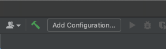
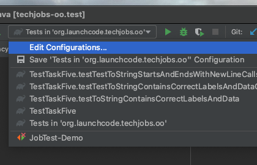
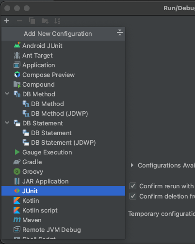
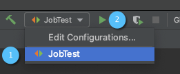

Instead of manually creating sample `Job` objects to verify that your class works correctly, you will use unit tests instead.

Navigate to the package `org.launchcode.techjobs.oo.test` package and open the `JobTest` class. This file will hold all of the tests for the `Job` class.

## Creating a JUnit Run Configuration

Since this project contains two sets of tests used for different purposes—the autograding tests and the JUnit tests you are about to write—we have to set up a **run configuration** to allow us to run them independently. We’ll show you how to do that now.

At the top right of IntelliJ, select _Add Configuration_, just left of the green _Run_ button.





If this item doesn’t have the label _Add Configuration_, then open the associated dropdown and select _Edit Configurations_.





In the modal that opens, click on the + icon at the top left, and select _JUnit_.





Fill out the resulting form using the values:

   1. **Name:** JobTest
   1. **Java version:** Java 17 
   1. **Module:** `techjobs-oo.test`
   1. **Class:** `org.launchcode.techjobs.oo.test.JobTest` (Click on the icon at the right side of this field and select the `JobTest` class from the modal that opens.)

Then hit _Apply_ and _OK_.

To run the tests, select the _JobTest_ configuration from the configurations menu and hit the green _Run_ button.





Now you’re ready to start writing some tests!

## Test the Empty Constructor
Each `Job` object should have a unique ID that is an integer.

1. In `JobTest`, define a test called `testSettingJobId`. Do not forget to annotate it with `@Test`.
1. Create two `Job` objects using the empty constructor.
1. Use `assertNotEquals` to verify that the IDs of the two objects are distinct.
1. Run the test using the run configuration that you created above.
1. If the test doesn’t pass, what should be your first thought?
   1. “Drat! I need to fix the unit test.”
   1. “Drat! I need to fix my `Job()` constructor code.”

   {} 
   The answer is NOT “a”.

   Your test code might be incorrect, but that should not be your FIRST thought. TDD begins with writing tests for desired behaviors. If the tests fail, that indicates errors in the methods trying to produce the behavior rather than in the tests that define that behavior.
  {}


## Test the Full Constructor
Each `Job` object should contain six fields—`id`, `name`, `employer`, `location`, `positionType`, and `coreCompetency`. The data types for these fields are `int`, `String`, `Employer`, `Location`, `PositionType`, and `CoreCompetency`, respectively.

1. In `JobTest`, define a test called `testJobConstructorSetsAllFields`.

1. Declare and initialize a new `Job` object with the following data:
   ```java
   new Job("Product tester", new Employer("ACME"), new Location("Desert"), new PositionType("Quality control"), new CoreCompetency("Persistence"));
   ```

1. Use assertTrue and assertEquals statements to test that the constructor correctly assigns _both_ the class and value of each field. Your test should have 5 assert statements of each type.

{} 
 The `instanceof` keyword can be used to check the class of an object. The result of the comparison is a boolean.

 ```java
 The instanceof keyword can be used to check the class of an object. The result of the comparison is a boolean.
 ```
{}

## Test the `equals` Method
Two `Job` objects are considered equal if they have the same `id` value, even if one or more of the other fields differ. Similarly, the two objects are NOT equal if their `id` values differ, even if all the other fields are identical.

   1. In `JobTest`, define a test called `testJobsForEquality`.

   1. Generate two `Job` objects that have identical field values EXCEPT for `id`. Test that `equals` returns `false`.

It might seem logical to follow up the `false` case by testing to make sure that `equals` returns `true` when two objects have the same ID. However, the positive test is irrelevant in this case.

The way you built your `Job` class, each `id` field gets assigned a unique value, and the class does not contain a `setId` method. You also verified that each new object gets a different ID when you tested the constructors. Without modifying the constructors or adding a setter, there is no scenario in which two different jobs will have the same ID number. Thus, we can skip the test for this condition.

{} 
Time to `save`, `commit`, and `push` your work to GitHub again.
{}


[Next]()

