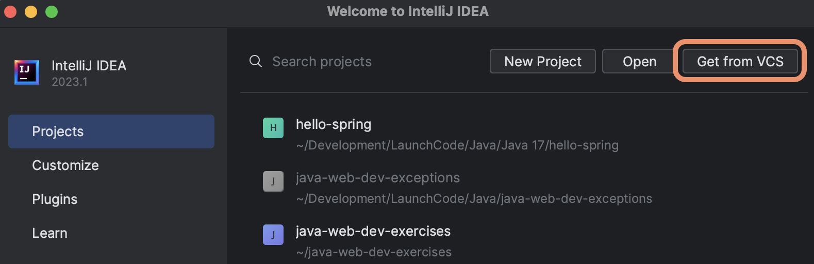
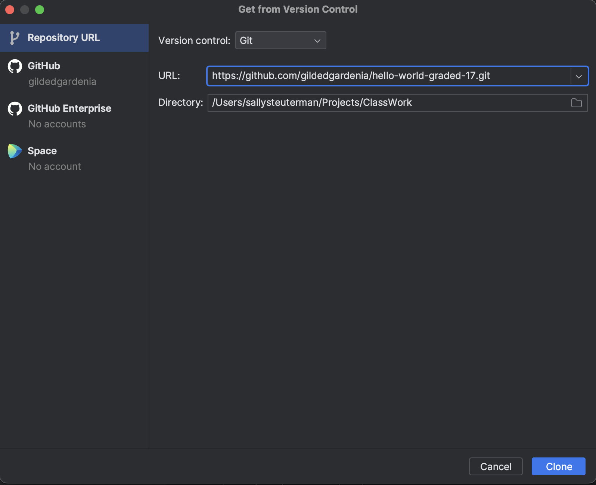
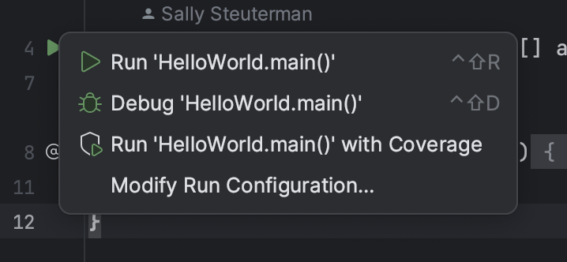
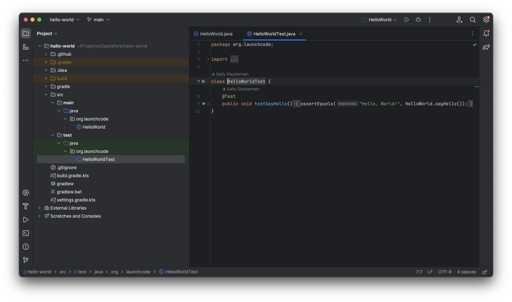
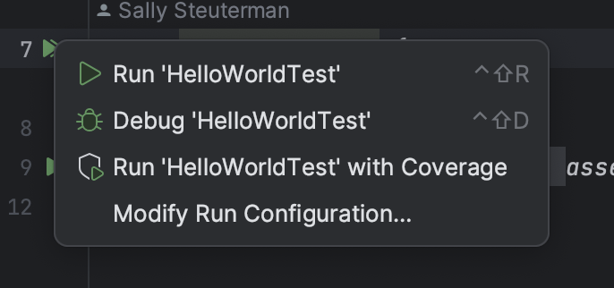
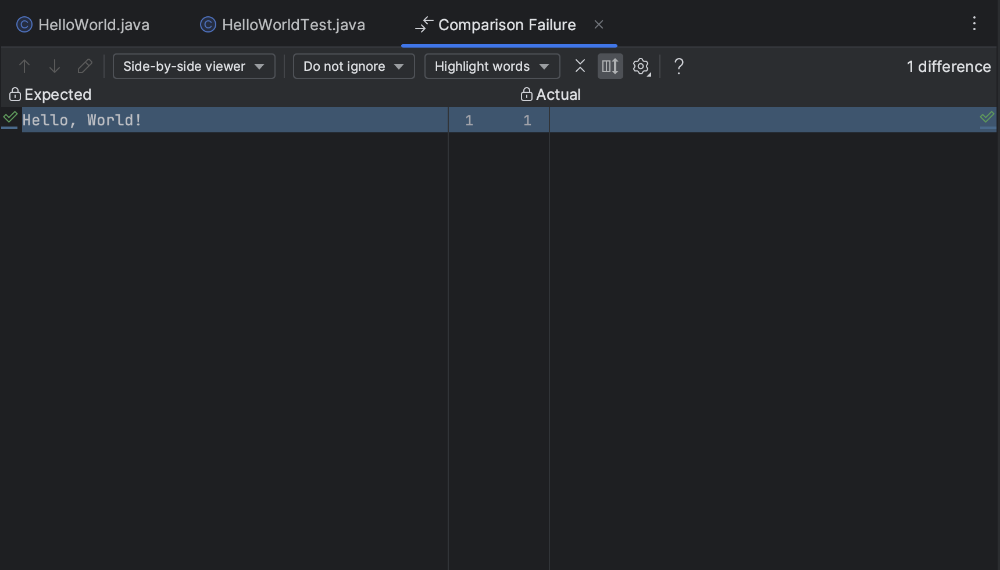
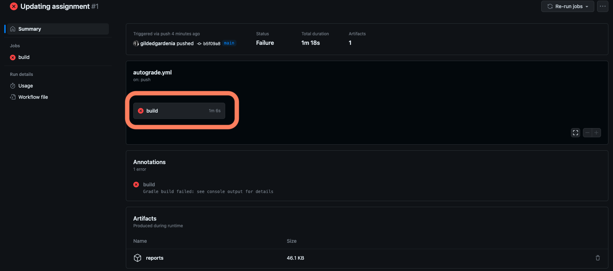
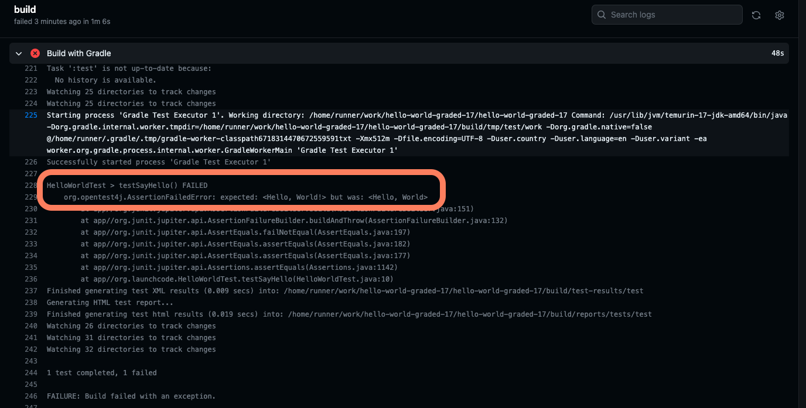

The purpose of this initial assignment is to familiarize yourself with the process of running the autograding tests with Github Actions and submitting your work. Even if you are familiar with GitHub Actions, this assignment will contain several new items that are specific to working with Java assignments.

## Getting Started

Let's set up the assignment on our computer and learn about its basic structure.

First, find Assignment #0 in Canvas and click on the starter code repo link. Fork the repository to your personal profile, copy the repo's URL for cloning, and open up IntelliJ.

Make sure IntelliJ is running and all project windows are closed. You should see IntelliJ's **Welcome** pane. From here, select the *Get from VCS* option.

Paste the repo URL in the URL field of the *Get from Version Control* pane that IntelliJ has opened. Make sure the *Directory* field is the location that you want your assignment to be saved within, then click the *Clone* button.

{}

Where you save your project matters! IntelliJ will only save it to a folder that is *currently* empty.

{}

After IntelliJ clones your repository, it will ask you if you trust the contents in the repository. Select *Trust Project*.

When the project opens initially, the *Project* pane at the left of the screen should be open and will show you the files within your project. If it is closed, click on the pane's button at the top left to open it.

Navigate though the directories down to the `HelloWorld` class. This will be in the `src/main/java/org.launchcode` directory. For all of the assignments we work on in this unit, our source code will live within this directory.

Note that there are two green "play" buttons on the left of the source code. This indicates that IntelliJ recognizes this class as being runnable code. You can use either of these buttons to run the program. They function exactly the same. Clicking on one of them opens up a menu with a few options. Choose the first to run the program.

When the program runs, IntelliJ will open a pane at the bottom of the window and display program output. Currently, the program has no output. You'll fix that in a bit.

## Running the Autograding Script Locally

We encourage you to run the autograding tests yourself *before* you push your code. Github Actions may take a moment to run so running your tests locally will make it quicker and easier to know whether or not your code is correct. Let's learn how to run the tests in IntelliJ.

In the *Project* pane, navigate to the test class, `HelloWorldTest`, in the directory `src/test/java/org.launchcode`. For each assignment, this directory will contain all of the autograding tests, and it may have more than one class.

Notice the two slightly different "play" buttons at the left of the code. The topmost button is actually two green "play" arrows stacked on top of each other. It allows you to run *all* of the tests in a given file. 

The lower button, next to the `testSayHello()` method, will run only that individual test. A test is a single method in a test file that has `@Test` just above it. A test file may have multiple tests.

Run all of the tests (in this case, there is only one) by clicking on the topmost button.

A menu opens, and selecting the first option runs the tests.

When IntelliJ runs the tests, it opens a pane at the bottom of the window to display test results. At the left, we see that the test has failed. We can expand the tree to see each of the individual tests (again, in this case there is only one). Selecting one of the tests shows its results to the right. 

This console-based test output can be hard to read, but IntelliJ provides a nicer interface for viewing test results. Follow the *Click to see difference* link to open this pane.

On the left, you'll see the output that the test expected. On the right, you'll see the output that your program actually provided. IntelliJ will highlight the difference between the two, showing you exactly why your test failed.

In this case, the test expected our code to output `Hello, World!`. Instead, it provided no output at all.

{}

   The autograding tests are VERY exacting. A difference of just one character will result in a failed test. The tests are also case-sensitive. You'll need to pay attention to detail in order to complete your assignments.

{}

When your code is correct, IntelliJ will display a green checkmark indicating passing tests.

## Your Task

Your task is simple: make the program print out the string `"Hello, World!"`. Only edit the code in the `HelloWorld` class, within the `sayHello()` method. When your code is correct, running the tests will display passing results. Once your tests pass, you are ready to submit your work and run the autograder.

## Running the Autograding Tests through Github Actions

Before you commit and push your work to Github, head over to the repository page on Github. On the repository page, right below the name, you have a number of options. Click on *Actions*.

We have set up the autograding for you, but you need to allow the workflow to run. Select *I understand my workflows, go ahead and enable them* within the Actions tab. Now the autograder is ready to check your work!

Open IntelliJ's *Terminal* pane. You should commit and push your code to GitHub.

Visit your assignment repository page. Actions may take a minute to run. While the autograding workflow is running, you will see a small yellow circle near the top right.  Once the action has completed running, you'll see a green checkmark indicating that GitHub has graded your assignment as passing. If you see a red "X", then your assignment is not yet correct.

This process will be the same for all of your assignments in this unit. Revisit this page as needed to review instructions on running tests in Java projects.

### How to Deal With a Failing Assignment

Sometimes you may get a red "X" and you need to break out your debugging skills to get down to the bottom of the problem!

1. Click on the *Actions* tab and select the run that failed.
1. You will be taken to that particular run's detail page. This is where you can find more detail about what happened to cause the autograder to fail. In the  pane labeled "autograde.yml on: push", select the rectangle that says "build" with a time next to it.

   

1. You can now review the console output for what happened when the autograding action ran. You will find that a number of tasks occur when this action ran. Click on *Build with Gradle* to find the console output related to the tests.
1. Read through the output carefully. In our example, the reason why the test failed was because we forgot the exclamation point at the end of "Hello, World!". So our best course of action here would be to return to IntelliJ, edit the `sayHello()` method, re-run our tests locally to confirm that the tests pass, and then commit and push our work to Github. 

   

{}

If the autograder is failing and you cannot determine the root cause, please reach out to course staff for assistance as soon as possible! 

{}

## Submitting Your Work on Canvas

When you are satisfied with your work, copy the URL to your repository on Github and paste it in the submission field for Assignment #0 on Canvas.
