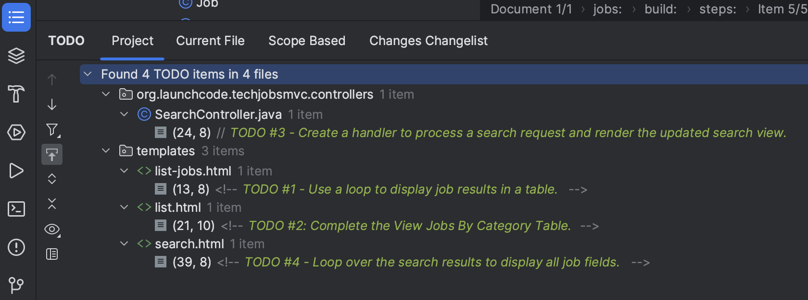

## Getting Started

Set up a local copy of the project:

1. The starter code for this project is in [this github repository](https://github.com/LaunchCodeEducation/techjobs-mvc-java-graded-17.git). Fork, clone, and then set up the project in IntelliJ. Refer back to the instructions from [Assignment 0]({}) for details. 
1. Launch the application (via the Gradle pane, *Tasks > Application >
   bootRun*) to make sure it starts up. Then shut it down.
1. Run the autograding tests. The tests for this assignment are set up the same way as for [Assignment 2]({}). There are four tasks for this assignment, but the first doesn't require any coding on your part. Therefore, there are 3 test files (for tasks 2-4). As with Assignment 2, we recommend that you only run the tests for the task you are currently working on.

## Review the Code

{}

   One essential programming skill that you will develop is the ability to read
   and understand someone else's code. This assignment begins with you
   practicing exactly that. Make sure you carefully examine the provided code
   BEFORE you start changing things.

   Trying to "fix" a code sample before understanding how it works leads to
   confusion, frustration, and a broken program. DO NOT SKIP the code review!

{}

Carly created a Spring Boot application and filled in some features. She
refactored `JobData` to generate an ArrayList of `Job` objects based on
your TechJobs-OO work, and she added controllers and views for a "Home",
"List", and "Search" page. `JobData` now also builds ArrayLists for the
`Employer`, `Location`, `PositionType`, and `CoreCompetency` objects.

### The Model

{}

   When referring to Java class locations, we’ll usually omit the leading
   path: `src/main/java/org/launchcode/`.

{}

The "model" is contained in the `JobData` class, which is in the `models`
package. We put "model" in quotes, since this class isn’t a model in the
typical, MVC/object-oriented sense (maybe a better name for this assignment
would be *TechJobs VC*).

The `JobData` class serves the same purpose as before---it reads data from
the `job_data.csv` file and stores it in a format we can use. In this case,
that format is an ArrayList of `Job` objects. Note that Carly changed the
path to the `job_data.csv` file to store it in the `src/main/resources`
directory.

You’ll use some of the static methods provided by `JobData` in your
controller code. Since you’re already familiar with these, we’ll leave it to
you to review their functionality as you go.

### The Controllers

Expand the `controllers` package, and you’ll see that you have three
controllers already in place. Let’s look at these one at a time.

#### The `HomeController`

This class has only one handler method, `index`, which displays the home page
for the app. The controller renders the `index.html` template (in
`src/main/resources/templates`) and provides a fairly simple view.

#### The `ListController`

This controller provides functionality for users to see either a table showing
all the options for the different `Job` fields (`employer`, `location`,
`coreCompetency`, and `positionType`) or a list of details for a selected
set of jobs.

If you look at the corresponding page at `/list`, you’ll see an "All" column
in the table. However, this option doesn’t work yet, and you will fully
implement that view as you work on the assignment.

At the top of `ListController` is a constructor that populates
`columnChoices` and `tableChoices` with values. These HashMaps play the
same role as in the console app, which is to provide a centralized collection
of the different *List* and *Search* options presented throughout the user
interface.

`ListController` also has `list` and `listJobsByColumnAndValue` handler
methods, with routes as annotated above their definitions. The first method
renders a view that displays a table of clickable links for the different job
categories. The second method renders a different view that displays
information for the jobs that relate to a selected category. Both of the
handlers obtain data by implementing the `JobData` class methods.

In the `listJobsByColumnAndValue` method, the controller uses two query
parameters passed in as `column` and `value` to determine what to fetch
from `JobData`. In the case of `"all"` it will fetch all job data,
otherwise, it will retrieve a smaller set of information. The controller then
renders the `list-jobs.html` view. We’ll explore the `list.html` and
`list-jobs.html` templates in a moment.

`listJobsByColumnAndValue` works similarly to the search functionality, in
that we are "searching" for a particular value within a particular field and
then displaying jobs that match. However, this is slightly different from the
other way of searching in that the user will arrive at this handler method as a
result of clicking on a link within the `list` view, rather than via
submitting a form. We’ll see where these links originate when we look at the
views. Also note that the `listJobsByColumnAndValue` method deals with an
"all" scenario differently than if a user clicks one of the category links.

#### The `SearchController`

Currently, the search controller contains only a single method, `search`.
It simply renders the form defined in the `search.html` template.

Later in this assignment, you will receive instructions for adding a second
handler to deal with user input and display the search results.

### The Views

Let’s turn our attention to the views.

#### The `fragments` File

If the application is not running, launch it and navigate to the site’s home
page in your browser. Also open up the
`src/main/resources/templates/index.html` file in IntelliJ. You’ll notice
that there is a fair amount of content visible on the page that isn’t contained
in `index.html`. This is because we’re using two fragments from
`fragments.html` (`head` and `page-header`). These allow for some basic
page structure and navigation to be shared across all of our views.

Have a look at the structure of `fragments.html`, but you will NOT need to do
any work within this file for this assignment.

{}

   We use [Twitter’s Bootstrap](http://getbootstrap.com/) CSS, HTML, and
   JS framework to provide some styling and functionality to our views. The
   appropriate files are included at the top of `fragments.html` and thus
   are included on every page of our app.

   You won’t have to explicitly use Bootstrap at all in this assignment,
   but it’s a great way to make your sites look good with minimal work.
   Consider using it in your own projects!

{}

#### The List Views

Turn your attention to `list.html`. This page displays a table of links
broken down into several categories. Data from `columnChoices` is used to
fill in the header row, and information stored in `tableChoices` generates
the link text.

The most interesting part of this template is how we generate the links:

```html {linenos=true}
   <td th:each="category : ${tableChoices}">
      <ul>
         <li th:each="item : ${category.value}">
            <a th:href="@{/list/jobs(column=${category.key},value=${item})}" th:text="${item}"></a>
         </li>
      </ul>
   </td>
```

1. `tableChoices` is a HashMap from `JobData`, and it contains the names of
   the `Job` fields as keys (`employer`, etc.). The value for each key is
   an ArrayList of `Employer`, `Location`, `CoreCompetency`, or
   `PositionType` objects.
1. In line 1, `category` represents one key/value pair from
   `tableChoices`, and in line 3, `item` represents one entry from the
   stored ArrayList.
1. We’ve seen the syntax `@{/list/jobs}` to generate a link within a Thymeleaf
   template, but we haven’t seen the other portion of the link:
   `(column=${category.key},value=${position})`. This syntax causes Thymeleaf
   to dynamically generate query parameters for our URL.

In line 4, we set these parameters by using `column=` and `value=`. The
values of these parameters are determined dynamically based on
`${category.key}` and `${item}`. Since these values come from
`tableChoices`, the *keys* will be `employer`, `location`, etc. The
*values* will be the individual elements from the related ArrayList. When the
user clicks on these links, they will be routed to the
`listJobsByColumnAndValue` handler in `ListController`, which looks for
these parameters.

Clicking on one of the links will display a list of jobs that relate to the
choice, via the `listJobsByColumnAndValue` handler method. However, that
view, `list-jobs.html` isn’t working yet. While the handler method is fully
implemented, the view template needs some work.

For now, click one of the *Location* links. This sends a request as we
outlined above, but doing so only displays a page with a title and no job list.

The page you see at `/list/values?column=location&value=...` is generated by
the `list-jobs.html` template. It has a similar structure as `list.html`,
but the table consists of only one column.

{}

   Select "Kansas City" from the list of locations, and then check the address
   bar of your browser:

   ```console
      /list/jobs?column=location&value=Kansas%20City
   ```

   Thymeleaf inserts `%20` for us, to represent a space, but this may
   actually be hidden in your browser’s address bar.

{}

#### The Search View

Finally, click on *Search* from the home page, or the navigation bar, and open
up `search.html` in IntelliJ. You’ll see a search form (in both the browser
and template file) that gives the user the option of searching by a given
`Job` field, or across all fields. This is an exact visual analog of our
console application.

This template will be used to display search results, in addition to rendering
the form. This will give the nice user experience of easily searching multiple
times in a row.

### Wrap Up the Code Review

Once you understand the controllers and views that are already in place, you’re
ready to begin your work.

In IntelliJ, select *View > Tool Windows > TODO* to pop open a small pane at
the bottom of the window. This list is populated by any code comments that
start with `TODO`. You’ll see your tasks listed, and clicking on any one will
open the relevant file.



As you work on your tasks, remember to refer to the
[demo app](https://java-techjobs-mvc.launchcodelearning.org/).