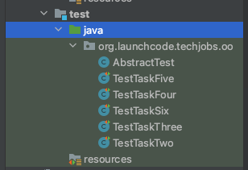
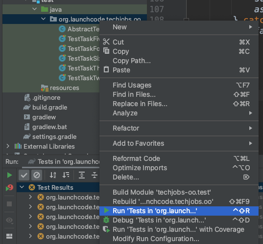
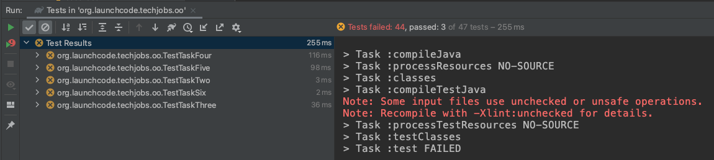
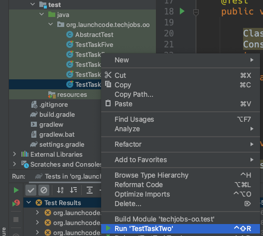

## Assignment #2: Tech Jobs (Object-Oriented Edition)

### Introduction

Your apprenticeship at LaunchCode is going well! Only a few weeks in and you’re regularly making contributions to code that will eventually be used by all LaunchCode staff.

Your last task was to get the prototype Tech Jobs app in good shape. Now it’s time to advance the underlying structure of the program.

Your mentor on this project is Sally, one of the developers at LaunchCode. She regularly supports coders who are just getting started with their careers.





After seeing your strong work with your last project, Blake reported that you performed well and learned quickly. Because of your success, he and Sally feel comfortable assigning you to a set of tasks that are a notch up in difficulty.

Sally completed some initial work on the project and left you some TODOs.

### Learning Objectives
In this project, you’ll show that you can:

1. Read and understand code written by others.
1. Work with objects to encapsulate data and methods.
1. Use the generator in IntelliJ to automate routine tasks.
1. Use unit testing and Test-Driven-Development (TDD) to verify and create new methods.
1. Apply the concept of inheritance to streamline your classes (the DRY idea—Don’t Repeat Yourself).


### Get the Starter Code

<!-- //TODO: add link to github classroom -->

In Canvas, Graded Assignment #2: TechJobs (Object-Oriented Edition) contains a [GitHub Classroom assignment]( ADD LINK) invitation link and then set up the project in IntelliJ. Refer back to the GitHub Classroom instructions from [Assignment #0: Hello, World!]() for details.

## Introduction
Sally has gotten the ball rolling by adding a `Job` class, along with classes to represent the individual properties of a job: `Employer`, `Location`, `PositionType`, and `CoreCompetency`. She completed the Employer class, and she left you the task of filling in the others.

As the team gets closer to deploying the app—and abandoning the test data they’ve been using—they’ll want an easy way to add and remove jobs via a user interface. Before that, however, you need to finish shifting the project to an object-oriented design.

## Why Change to Object-Oriented?
Working with data stored as strings in HashMaps and ArrayLists isn’t a good long-term solution, for reasons that we point out below.

The `Job` class introduces an object-oriented design to the application. It contains all of the fields you used in the console version of TechJobs: `name`, `employer`, `location`, `positionType`, `coreCompetency`. There’s also an id field which will be used to uniquely identify `Job` objects.

The main difference between the object representation of a job and the string-based representation is that the values of `employer`, `location`, and the other non-ID fields are no longer strings. Instead, they are classes of their own.

### Job Fields

Open the Job class file. You’ll see the following fields (among others):

```java{linenos=table,hl_lines=[],linenostart=10}
private String name;
private Employer employer;
private Location location;
private PositionType positionType;
private CoreCompetency coreCompetency;
```

Of these, only `name` is a string. Sally created classes to represent each of the other properties. These classes—`Employer`, `Location`, `CoreCompetency`, `PositionType`—have `value` and `id` fields.

So, for example, if you had a `Job` instance, you could get the name of the employer this way:

```java
// job is an instance of Job
String employerName = job.getEmployer().getValue();
```
Additionally, the `toString()` method of the `Employer` class is set up to return the `value` field. Thus, using one of these objects in another string context like `System.out.println` will print the data stored in `value`.

```java
// Prints the name of the employer
System.out.println(job.getEmployer);
```

Why do we go to all of this trouble when we could store this job-related data as strings? There are a couple of reasons.

### Eliminate Duplication of Data

In our app, we have multiple jobs that have the same value in a given field. For example, there are multiple jobs with position type “Web - Full Stack”, and each employer may list several jobs. If we store the values of these fields as strings directly within each `Job` object, that data would be repeated in several places across the application.

By using objects, we can have a single `PositionType` object with value “Web - Full Stack”. Each job that wants to use that position type holds onto a reference to the given object. Similarly, we can have one `Employer` object for each employer.

Aside from reducing the amount of raw data / memory that the application uses, this will allow data to be updated more easily and properly. If we need to change the name of an employer (e.g. due to a typo or a name change at the company), we can change it in one place—the single `Employer` object that represents that company.

### Enable Extension

While the four `Job` properties represented by objects will primarily be used for their string values, it’s easy to imagine adding new properties to address future needs.

For example, it would be useful for an `Employer` object to have an address, a primary contact, and a list of jobs available at that employer.

For a `Location` object, useful information includes a list of zip codes associated with that location, in order to determine the city and state for an employer or job.

If we were to store these four new properties as strings within the `Job` class, extending and modifying this behavior would be much more complicated and difficult moving forward.

## Your Assignment

### Running the Autograding Tests

Before diving into your tasks, review [Assignment #0: Hello, World!]() for details on running the autograding tests for this assignment. This assignment has many more tests than the previous two, so we’ve organized them into separate files.





Each of the one test files, `TestTaskXXXX`, contains the tests to grade one of the six tasks outlined in below (there’s no coding work for your first task, so there is no `TestTaskOne`). Run all of the tests by right-clicking on the `org.launchcode.techjobs.oo` and selecting `Run tests...`






You should see a large number of failures along with a small number of passing tests. Your job is to get those failures to pass, while not breaking the few tests that already pass.





When you start on one of the tasks below, begin by running only the tests associated with that task. To do so, right-click on the test file and select _Run TestTaskXXXX_.





As you work on the components of the given tasks, continually re-run the tests to see the failing tests gradually turn to passing. When all tests within the file pass, you’re ready to move onto the next task.

## Your tasks

The list below provides a general overview of your assigned tasks. Specific details for each part appear in the following sections, so be sure to read them carefully as you solve each problem.

1. Review Sally’s code in the `Employer` class to learn how to assign a unique ID.
1. Add getters, setters, and custom methods as needed to the `Location`, `CoreCompetency`, and `PositionType` classes.
1. Complete the `Job` class using what you learned in steps 1 and 2.
1. Use unit testing to verify the constructors and `equals` methods for the `Job` class.
1. Use TDD to design and code a custom `toString` method for the `Job` class.
1. Use inheritance to DRY the code within `Employer`, `Location`, `CoreCompetency`, and `PositionType`.

[Next]()
