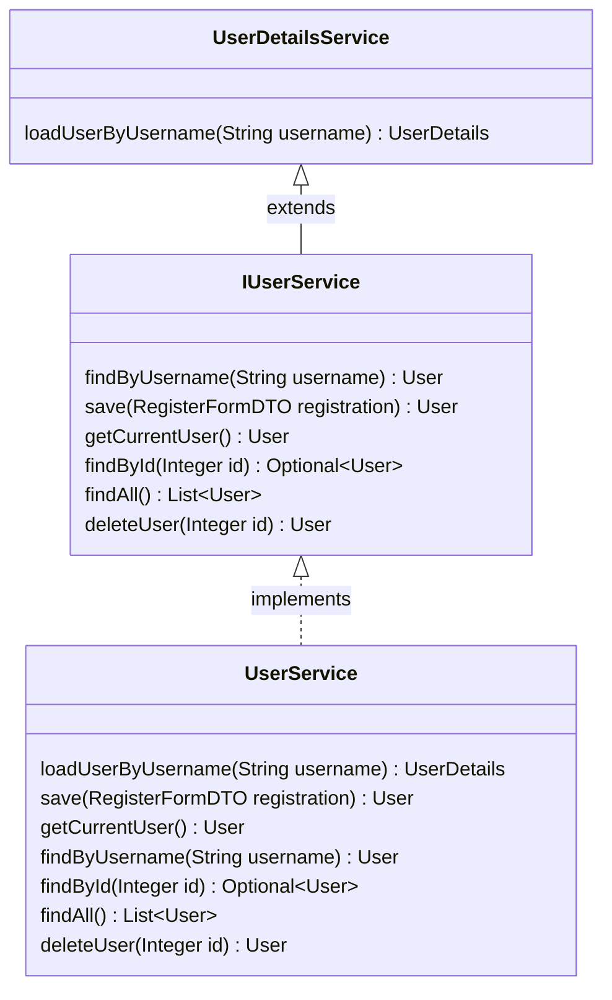

Up to this point, we have set up user authentication mostly on our own. The
`AuthenticationFilter` class hooks in to the request handler logic and will
prevent the request from accessing certain routes unless there is a HTTP
session key with a logged-in user. We manually set the session key during login.
The benefit of doing this logic manually was to learn the basics of user
authentication and how it can be implemented in the HTTP protocol.

This lesson will introduce more features of the Spring Security Framework to
handle user authentication. It will provide us classes and interfaces that are
defined within the `org.springframework.security.*` packages. The benefit of
learning and implementing this framework is a more robust set of security
and authentication features. It will require us to learn from documentation
and implement interfaces defined by Spring Security.

This walkthrough does not make use of all Spring Security features, and there
is much left that can be improved. Take this as an introduction to the more
advanced Spring Security framework.

{}
The Spring Security documentation can be found [here](#). This framework has
evolved and changed from version to version. We will be implementing the
Spring Security 6 framework.

Another helpful resource in preparing this tutorial was the
[Baeldung blog](https://www.baeldung.com/spring-security-authentication-and-registration),
which provides walkthroughs on a number of Spring related features and
frameworks.
{}

## Implementing Spring Security 6 for Authentication - VIDEO

**TODO**

## Implementing Spring Security 6 for Authentication - TEXT

To begin, we need to make sure that our Gradle project includes the necessary
dependencies for Spring Security 6.

Update the `build.gradle` file to include the following packages in the
`dependencies` object. You will also need to **remove** the
`spring-security-crypto:5.5.1` package

```groovy
    // Remove implementation("org.springframework.security:spring-security-crypto:5.5.1")
	implementation 'org.thymeleaf.extras:thymeleaf-extras-springsecurity6'
	implementation 'org.springframework.boot:spring-boot-starter-security'
```

This lesson will consist of four parts of implementation to adopt the
Spring Security framework:

1. Refactor `UserService` to implement Spring Security `UserDetailsService`
interface methods that take care of authentication and user session
1. Remove `AuthenticationFilter` and `WebApplicationConfig` to replace with
Spring Security 6 `WebSecurity` class, which handles authorization and
request filtering
1. Refactor other controllers and services to make use of updated `UserService`
1. Improve error pages and error redirection

### Authentication in Spring Security 6

Before diving in, take a look at the [Spring Security Authentication
documentation](https://docs.spring.io/spring-security/reference/servlet/authentication/architecture.html),
which describes the classes and components that implement the
behaviors we want to use.

We are going to implement username/password verification using the
`UserDetailsService` interface.

#### Implementing `UserDetailsService`

The `UserDetailsService` implementation returns a `UserDetails` object which
is a Spring Security representation of username, password, and granted user
authorities. We are going to refactor our `UserService` class to implement
a custom `IUserService` interface that we create. Our `IUserService` interface
will extend the `UserDetailsService` interface that we are required to use for
Spring Security.



Create a new *interface* in the `codingevents.services` package named
`IUserService`.

This interface should **extend** the `UserDetailsService` interface, which
is found in the `org.springframework.security.core.userdetails` package.

`IUserService` should include two method definitions, which mirror the
methods we have already implemented in `UserService`.

1. `User findByUsername(String username);`
1. `User save(RegisterFormDTO registration);`

All together, our new interface should look like this:

```java
import org.springframework.security.core.userdetails.UserDetailsService;

public interface IUserService extends UserDetailsService {
    User findByUsername(String username);
    User getCurrentUser();
    User save(RegisterFormDTO registration);
	Optional<User> findById(Integer id);
	List<User> findAll();
	User deleteUser(Integer id);
}
```

Next, we will refactor our `UserService` class to properly implement
the method required by `UserDetailsService` interface.

First, modify your `UserService` class to be an implementer of the
interface `IUserService`, and add the `@Transactional` annotation as well.
This annotation will make sure that each `UserService` method completes all
of it's actions successfully or none of them will take effect.

```java
@Service
@Transactional
public class UserService implements IUserService {
```

Once we add this interface, we will get an error saying that we must provide an
implementation of `loadUserByUsername` from the `UserDetailsService` interface.

This method will take in a username string and it needs to return a
`UserDetails` object. For us, that will mean returning a `User` instance from
the `org.springframework.security.core.userdetails` package. The [documentation
for this constructor](https://docs.spring.io/spring-security/site/docs/current/api/org/springframework/security/core/userdetails/User.html#%3Cinit%3E(java.lang.String,java.lang.String,java.util.Collection))
shows that we need the username, the password hash, and a
collection of the granted authorities for this user.

Add the following method to your `UserService` class. Notice the call to the
`getAuthorities` method that is not yet implemented.

```java
    @Override
    public UserDetails loadUserByUsername(String username) throws UsernameNotFoundException {
        User user = userRepository.findByUsername(username);
        if (user == null) {
            throw new UsernameNotFoundException("Invalid username or password");
        }
        return new org.springframework.security.core.userdetails.User(user.getUsername(),
                user.getPwHash(),
                getAuthorities());
    }
```

For now, we are going to implement the `getAuthorities` method to return the
same authority for all users which is `ROLE_USER`. In the next lesson, we will
make sure that the granted authorities are correct based on the actual role of
each user.

This helper method will return the authorities in the datatype required by the
`UserDetails` instance, which is `Collection<? extends GrantedAuthority>`. Add
the `getAuthorities` method to the `UserService` class as well, preferably
at the bottom as it is a `private` method.

```java
    private Collection<? extends GrantedAuthority> getAuthorities() {
        return Collections.singletonList(new SimpleGrantedAuthority("ROLE_USER"));
    }
```

Lastly, we can update our `getCurrentUser` method to use the Spring Security
framework for retrieving the current user from the `SecurityContextHolder`
mentioned in the Authentication documentation, which tracks the currently
authenticated user in an `Authentication` object.

Let's modify our `getCurrentUser` method to make use of the framework:

```java
    public User getCurrentUser() {
        Authentication auth = SecurityContextHolder.getContext().getAuthentication();
        if (auth == null || !auth.isAuthenticated()) {
            return null;
        }
        return findByUsername(auth.getName());
    }
```

### Authorization and Request Filtering with `WebSecurity`

Our current implementation of request filtering has done a good job of teaching
us about the basics of user authentication. We currently implement the
`HandlerInterceptor` interface so that we can check if a user is stored in the
`HttpSession` before a request is handled by our controllers. If there is not
an authenticated user stored in session, we redirect them to the login page.

Spring Security 6 framework has some built-in annotations and methods that will
do the same logic but will handle the user authentication and session management
internally.

Take a look at the [Spring Security documentation](https://docs.spring.io/spring-security/reference/servlet/authorization/authorize-http-requests.html)
that talks about how we will authorize each request. With the authentication
that we set up in the previous section, the `HttpSecurity` instance can be used
to setup request filtering.

To begin, we can **remove** the `AuthenticationFilter` class entirely, as well
as the `WebApplicationConfig` class.

Next, create a new class `WebSecurity` in the `security` package. This class
will set up the `SecurityFilterChain` described in the [Authorizing
Requests](https://docs.spring.io/spring-security/reference/servlet/authorization/authorize-http-requests.html#authorize-requests)
section of the documentation.

This class should also include `UserService` and `PasswordEncoder` autowired
fields.

```java
@Configuration
@EnableWebSecurity
@EnableMethodSecurity
@EnableTransactionManagement
public class WebSecurity {

    @Autowired
    private UserService userService;

    @Autowired
    private PasswordEncoder passwordEncoder;
}
```

1. `@Configuration` annotation lets Spring know that this class will set up
a `@Bean`
1. `@EnableWebSecurity` annotation lets Spring know that this class will set
up the `SecurityFilterChain` bean
1. `@EnableMethodSecurity` annotation gives the ability to use some helpful
annotations to secure specific controller methods
1. `@EnableTransactionManagement` annotation allows our Spring project to use
the `@Transactional` annotation elsewhere

To set up the `SecurityFilterChain`, we will use method chaining to build an
`http` object that contains filtering rules for requests, meaning which
routes are permitted and which ones require authentication,
as well as error routes. We build this filter chain using a design pattern known
as the **builder pattern**. This [helpful article](https://www.springcloud.io/post/2023-03/spring-security-design-patterns/#gsc.tab=0)
lists some of different design patterns used in the Spring framework, for more
context.

Add the following method to the `WebSecurity` class:

```java
    @Bean
    public SecurityFilterChain filterChain(HttpSecurity http) throws Exception {
        http
            .authorizeHttpRequests(authorize -> authorize
                .requestMatchers("/login",
                    "/register",
                    "/logout",
                    "/error",
                    "/css/**",
                    "/js/**",
                    "/img/**").permitAll()
                .anyRequest().authenticated()
            )
            .csrf(csrf -> csrf.disable())
            .logout(logout -> logout
                .logoutUrl("/logout")
                .invalidateHttpSession(true)
                .clearAuthentication(true)
                .logoutSuccessUrl("/login")
                .permitAll()
            )
            .securityContext((securityContext) -> securityContext
			    .securityContextRepository(securityContextRepository())
                .requireExplicitSave(true)
		    )
            .exceptionHandling(exception -> exception
                .authenticationEntryPoint(authenticationEntryPoint())
            );
        return http.build();
    }
```

With each of the methods in this method chaining sequence, we are setting up
a portion of the security filter. The `exceptionHandling` and `securityContext`
methods require a custom `@Bean` method and class so that we can access the
objects in another class.

First, we'll add a `SecurityContextRepository` bean which will implement the
storage of our `SecurityContext` across different requests, so that we can
remember who is logged in. Think of this as storing the `SecurityContext` which
contains our `Authentication` information in the session.

Add the following method to the `WebSecurity` class:

```java
    @Bean
    public SecurityContextRepository securityContextRepository() {
        return new DelegatingSecurityContextRepository(
            new RequestAttributeSecurityContextRepository(),
            new HttpSessionSecurityContextRepository()
        );
    }
```

Next, add the `authenticationEntryPoint` method to the `WebSecurity` class:

```java
    @Bean
    public AuthenticationEntryPoint authenticationEntryPoint() {
        return new CustomAuthenticationEntryPoint();
    }
```

After adding this method, we'll need to create the
`CustomAuthenticationEntryPoint` which will be responsible for sending errors
to either `/login` route for unauthenticated requests or `/error` route
otherwise.

Create this new class in the `security` package.

```java
@Component
public class CustomAuthenticationEntryPoint implements AuthenticationEntryPoint {
    @Override
    public void commence(HttpServletRequest request, HttpServletResponse response, AuthenticationException authException)
        throws IOException, ServletException {
        Authentication auth = SecurityContextHolder.getContext().getAuthentication();
        if (auth == null || !auth.isAuthenticated()) {
            response.sendRedirect(request.getContextPath() + "/login");
        } else {
            response.sendRedirect(request.getContextPath() + "/error/403");
        }
    }
}
```

Our last step to enable authorization in Spring Security is to set up our
custom `AuthenticationManager` which will use our `UserService` and
`PasswordEncoder` instances (from the autowired fields) to get the
`UserDetails` instance.

Add this last method to the `WebSecurity` class:

```java
    @Bean(name = BeanIds.AUTHENTICATION_MANAGER)
    public AuthenticationManager authenticationManagerBean(HttpSecurity http) throws Exception {
        AuthenticationManagerBuilder authenticationManagerBuilder =
            http.getSharedObject(AuthenticationManagerBuilder.class);

        authenticationManagerBuilder.userDetailsService(userService).passwordEncoder(passwordEncoder);

        return authenticationManagerBuilder.build();
    }
```

In the next section, our task will be to update our controllers to use the new
`UserService` and make use of the `Authentication` in the
`AuthenticationController`.

### Refactoring Controllers & Services

We have to update the following classes in this section:

1. `AuthenticationController` to use `AuthenticationManager` for login
1. `SecurityService` to use `UserService` and `SecurityContextHolder`
1. `EventCategoryService` to use updated `getCurrentUser`
1. `EventCategoryController` to use updated service
1. `EventService` to use updated `getCurrentUser`
1. `EventController` to use updated service

#### Update `AuthenticationController`

Recall that we have plugged in to the Spring Security framework by using
`UserDetailsService` interface and relying on `Authentication` objects
from `SecurityContextHolder`.

In the `AuthenticationController` we can now remove some previous methods
we needed when we were managing users in session.

First, add a field for the `AuthenticationManager` and the
`SecurityContextRepository`.

```java
    @Autowired
    private AuthenticationManager authManager;

    @Autowired
    private SecurityContextRepository securityContextRepository;
```

Next, we can **remove** the `getUserFromSession` and `setUserInSession` methods
entirely.

Lastly, we are going to update the `processLoginForm` to use the
`SecurityContextHolder` and `Authentication` objects for user
session management. The `processLoginForm` is going to completely change with
this refactoring, so you can start by **deleting** the contents of the method.
We will start from scratch (including our error check and the title of the page
in case of errors). Also, add the parameter for `HttpServletResponse` to the
method.

```java{ hl_lines="4" }
    @PostMapping("/login")
    public String processLoginForm(@ModelAttribute @Valid LoginFormDTO loginFormDTO,
                                   Errors errors, HttpServletRequest request,
                                   HttpServletResponse response,
                                   Model model) {
        model.addAttribute("title", "Log In");
        if (errors.hasErrors()) {
            return "login";
        }
    }
```

The next portion of this method will be a `try/catch` block that protects from
the possibility of an `AuthenticationException`.

Take a look at the [AuthenticationManager documentation](https://docs.spring.io/spring-security/site/docs/current/api/org/springframework/security/authentication/AuthenticationManager.html)
which has a method `authenticate()`. We will create a Username/Password token
that we send to the `authenticate()` method for username/password validation.
We will also use the `securityContextRepository` field to save the new
`SecurityContext` established by the user login. If we catch an
`AuthenticationException` instance, we will let the user know that the
username or password were incorrect.

Add the following block to your `processLoginForm` method:

```java
        try {
            UsernamePasswordAuthenticationToken token =
                UsernamePasswordAuthenticationToken.unauthenticated(
                    loginFormDTO.getUsername(),
                    loginFormDTO.getPassword()
                );
            Authentication authentication =
                authManager.authenticate(token);

            SecurityContext context = SecurityContextHolder.createEmptyContext();
            context.setAuthentication(authentication);
            this.securityContextRepository.saveContext(context, request, response);

            return "redirect:";
        } catch (AuthenticationException ex) {
            errors.rejectValue("username", "bad.credentials", "Invalid e-mail or password");
            return "/login";
        }
```

Last, weirdly enough, we can remove our request handler for logout, as we
included the `/logout` route as part of our security filter setup in
`WebSecurity`. Navigating to `/logout` will invalidate the security session
automatically.

#### Update `EventCategoryController`

To update `EventCategoryController`, we want to remove the reference to
`authController` that is used to retrieve the current user. Instead we'll
make a call to a `eventCategoryService` method that assumes the current
user.

In `EventCategoryController`, remove the field that references
`AuthenticationController`, and update the `displayAllCategories` method to
call `eventCategoryService.getAllCategoriesByCurrentUser()`, like below:

```java
    @GetMapping
    public String displayAllCategories(Model model, HttpSession session) {
        model.addAttribute("title", "All Categories");
        model.addAttribute("categories", eventCategoryService.getAllCategoriesByCurrentUser());
        return "eventCategories/index";
    }
```

#### Update `EventController`

Our goal for `EventController` will be the same as `EventCategoryController`:
to remove all references to `AuthenticationController` and the code to grab the
current user. Instead, we will make calls to `eventService` and
`eventCategoryService` methods that assume the current user.

First, **remove** the `AuthenticationController` autowired field.

Next, we need one new method in `EventCategoryService` for retrieving a
category that the current user created by the category id. We want to prevent
the ability for a user to look up any event category instance by id.

Add the following method to `EventCategoryService`:

```java
    public EventCategory getCategoryByIdForCurrentUser(int id) {
        return getCategoryByIdAndCreator(id, userService.getCurrentUser());
    }
```

Now we can update the `EventController displayEvents` method to use
`eventService` and `eventCategory` service only:

```java
    @GetMapping
    public String displayEvents(@RequestParam(required = false) Integer categoryId, Model model, HttpSession session) {
        if (categoryId == null) {
            model.addAttribute("title", "All Events");
            model.addAttribute("events", eventService.getAllEventsByCurrentUser());
        } else {
            try {
                EventCategory category = eventCategoryService.getCategoryByIdForCurrentUser(categoryId);

                model.addAttribute("title", "Events in category: " + category.getName());
                model.addAttribute("events", category.getEvents());
            } catch(ResourceNotFoundException ex) {
                model.addAttribute("title", "Invalid Category ID: " + categoryId);
            }
        }

        return "events/index";
    }
```

Update the other methods to use
`eventCategoryService.getAllCategoriesByCurrentUser()` and
`eventService.getAllEventsByCurrentUser()` functions.
For the `displayEventDetails` method, we need to add a similar method to the
`EventService` class:

```java
    public Event getEventByIdForCurrentUser(int id) {
        return getEventByIdAndCreator(id, userService.getCurrentUser());
    }
```

With that method, we can update `displayEventDetails` to use
`eventService.getEventByIdForCurrentUser(eventId)` like the lines below:

```java
    @GetMapping("detail")
    public String displayEventDetails(@RequestParam Integer eventId, Model model, HttpSession session) {
        try {
            Event event = eventService.getEventByIdForCurrentUser(eventId);
```

### Updating Error Handling & `SecurityService`

When a user tries to access a route that does not exist, or a resource id
that they don't own, we need to send them to a predesigned error page. We
can do that with exception handling and automatic routing to an error
controller.

#### Adding `ErrorController`

In the `controllers` package, create a class named `ErrorController`. This
class will handle `ResourceNotFoundException` and `BadRequestException`.

```java
@ControllerAdvice
public class ErrorController {

    @ExceptionHandler(ResourceNotFoundException.class)
    @ResponseStatus(HttpStatus.NOT_FOUND)
    public String exception(final ResourceNotFoundException ex, final Model model) {
        model.addAttribute("message", ex.getMessage());
        return "error/404";
    }

    @ExceptionHandler(BadRequestException.class)
    @ResponseStatus(HttpStatus.BAD_REQUEST)
    public String exception(final BadRequestException ex, final Model model) {
        model.addAttribute("message", ex.getMessage());
        return "error/400";
    }

}
```

Next, we need to create the `BadRequestException` in the `exception` package:

```java
public class BadRequestException extends RuntimeException {
    public BadRequestException() {

    }

    public BadRequestException(String message) {
        super(message);
    }

    public BadRequestException(String message, Throwable cause) {
        super(message, cause);
    }

    public BadRequestException(Throwable cause) {
        super(cause);
    }

    public BadRequestException(String message, Throwable cause, boolean enableSuppression,
                               boolean writeableStackTrace) {
        super(message, cause, enableSuppression, writeableStackTrace);
    }
}
```

The `ErrorController` will handle exceptions and the `/error` route, but we need
to add some views for it to display.

In the `resources/templates/error/` directory, create a Thymeleaf view named
`400.html`:

```html
<!DOCTYPE html>
<html lang="en" xmlns:th="http://www.thymeleaf.org/">
<head th:replace="~{fragments :: head}"></head>
<body class="container">

<header th:replace="~{fragments :: header}"></header>

<div>
    <p>Incorrect data provided</p>
</div>

</body>
</html>
```

Create `403.html` that has the same content except a message that says:

```html
<div>
    <h1>You have no access to this site</h1>
</div>
```

Create `404.html` that has the following message:

```html
<div>
    <p>Resource not found</p>
</div>
```

#### Updating `SecurityService`

Our last miscellaneous task is to update the `SecurityService` class to use
the Security framework. We do not currently use this service for any
functionality but its methods can be used for role authorization if needed.

Our goal is to remove the use of `AuthenticationController` and instead use the
`SecurityContext` and `UserService` for our needs. Replace the
`AuthenticationController` field with `UserService`:

```java
    @Autowired
    private UserService userService;
```

The `hasPrivilege` method will be completely refactored, so you can delete the
body of the method. We will use the `SecurityContextHolder` to retrieve any
currently stored `Authentication` object and use that to get the current `User`
and their privileges:

```java
    public boolean hasPrivilege(String privilege) {
        final User theUser = userService.getCurrentUser();
        if (theUser == null) {
            return false;
        }

        Boolean hasPrivilege = theUser.getRoles()
            .stream()
            .map(Role::getPrivileges)
            .flatMap(coll -> coll.stream())
            .map(Privilege::getName)
            .anyMatch(p -> p.equals(privilege));
        return hasPrivilege;
    }
```

Update the `hasRole` method similarly:

```java
    public boolean hasRole(String role) {
        final User theUser = userService.getCurrentUser();
        if (theUser == null) {
            return false;
        }
        Boolean hasRole = theUser.getRoles()
            .stream()
            .map(Role::getName)
            .anyMatch(r -> r.equals(role));
        return hasRole;
    }
```

That wraps up our Spring Security refactoring. Be sure to test and
make sure that register and login work, as well as proper loading of
and creation of user data.

The next lesson will add some new roled-based features for users, limiting
access to the roles that users are assigned.


