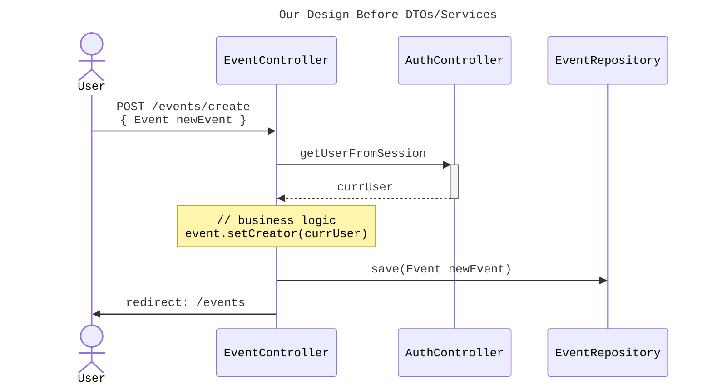
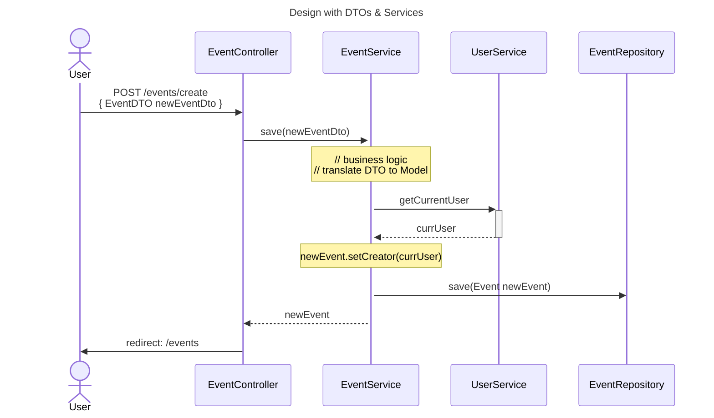

It's time for us to expand on a previous topic used in Chapter 18.
We used **Data Transfer Objects** or DTOs to separate the structure
of our Models from the needs of our client requests or views.

## Separating Business Logic from Controllers

For example, we have a `RegisterFormDTO` containing a necessary `verifyPassword`
field when registering a new account, *but* the `verifyPassword` is not a field
that we need to store in the model. Our DTOs allow us to create data objects
that are specific to the requirements of a form or client request. They
translate the database definition in the Model to the client requirement of
a request.

In order to facilitate the translation of the database Models to a DTO, we will
add another "layer" to our design. The [sequence diagrams](https://en.wikipedia.org/wiki/Sequence_diagram)
below show how we will use modules
called **Services** to manage the interactions between the **Controllers** and the
**Repositories** / **Models**.

{}
Services are a design concept laid out in [Domain Driven Design](https://en.wikipedia.org/wiki/Domain-driven_design).
Any logic that does not fit neatly in to an object, such as the Controller
or Model, can be expressed as a service.
{}



In our current design without **Services**, our "business logic" --- the logic
that validates and configures our data before saving to the database --- is
handled in the **Controllers**. Our `Event` model also contains fields that are
not used in the `Create Event` form that users complete, such as `user_id`.

We can create a DTO that directly maps to the `Create Event` form,
which gives us flexibility to create customized forms with fields unrelated to
the database models. Again, consider the `RegisterFormDTO` which contained the
`verifyPassword` field, a necessary field for the form that does not end up in
the `User` Model.

With DTOs, our "business logic" will now include the translation of DTO fields to
Model fields. Rather than having this logic clutter our Controllers, we can
move it to the Service layer. Take a look at the diagram below and notice how
our `EventController` passes the `EventDTO` to the `EventService`, where the
"business logic" now resides.



## Adding DTOs & Services to CodingEvents - Video

**TODO**

## Adding DTOs & Services to CodingEvents - Text

### Adding `EventDTO` & `EventCategoryDTO`
We'll start by adding the `EventDTO`. This will be a POJO class that contains
every field from our `Create Event` form. Notice the flattening of the
`EventDetails`, meaning that the DTO has the fields from `EventDetails`
instead of a separate class/object for them.

Create a new package inside `codingevents` named `dto`, and move your
`RegisterFormDTO` and `LoginFormDTO` into the package.

Next, let's create the `EventDTO` class in the same package.

```java
public class EventDTO {
    @NotBlank(message = "Name is required")
    @Size(min = 3, max = 50, message = "Name must be between 3 and 50 characters")
    private String name;

    @Size(max = 500, message = "Description too long!")
    private String description;

    @NotBlank(message = "Email is required")
    @Email(message = "Invalid email. Try again.")
    private String contactEmail;

    private int categoryId;

    private int[] tagIds;

    public EventDTO() {}

    // Add setters & getters...
}
```

Add the getters and setters for the fields. Let's also add the DTO for
`EventCategory`. Create `EventCategoryDTO` in the `dto` package as well.

```java
public class EventCategoryDTO {
    @Size(min=3, message="Name must be at least 3 characters long")
    private String name;

    public EventCategoryDTO() {}

    // Add getters & setters...
}
```

### Prepping `User` model for `UserService`

We have a few updates we need to make to the `User` model to prep it for use
with the `UserService`. Namely, we need to move the `PasswordEncoder` class to
its own managed config. Our password encoder is currently a static instance
in the `User` model, but we will need access to our encoder within the
`UserService` so that we can validate a login password against the user's
encrypted password.

#### Creating `PasswordEncoder` bean

This password encoder object will be a managed Java bean, similar to a
controller, that can be referenced using an `@Autowired` field.

First, create a new package `config` within your `codingevents` package. Then,
create a new class `EncoderConfig` in the package.

```java
@Configuration
public class EncoderConfig {
    @Bean
    public PasswordEncoder passwordEncoder() {
        return new BCryptPasswordEncoder();
    }
}
```

The `@Configuration` annotation tells Spring that this class will contain
`@Bean` definitions for Spring managed objects. Inside the class, we
define a `@Bean` that will return an instance of the `BCryptPasswordEncoder`
that we were using the `User` class.

#### Refactoring `User` model

Next, we need to modify our `User` model for use of the `PasswordEncoder`.
We are going to rework our constructor so that a new `User` instance gets
the encoded password passed in, and the `User` object will not be responsible
for doing any encoding.

Remove the field containing the `static final BCryptPasswordEncoder`.

Modify the `User` constructor so that it takes in `String pwHash` as an argument
and uses it to set the field directly, removing the call to `encode`.

Lastly, remove the `isMatchingPassword` method and replace it with a getter for
the `pwHash` field.

Our `User` class is now refactored. Instead of having the `User` class be
responsible for encoding passwords, we will do password encryption in the
`UserService` and pass encrypted passwords to new `User` instances.

### Adding `UserService`

The reponsibilities of the service layer are to translate DTOs to Models
and handle interactions between the Controller and the Repository. To follow
this design, let's add a service to handle interactions between
`AuthenticationController` and `UserRepository`, and translating
`RegisterFormDTO` to `User` models.

{}
Services are built in to the [Spring Framework](https://docs.spring.io/spring-framework/docs/current/javadoc-api/org/springframework/stereotype/Service.html).
A class annotated with `@Service` will become a managed component
in the Spring application context, similar to `@Controller`, meaning that the
instance will be created by the Spring context. We can get a reference to a
service object in a different class using the `@Autowired` annotation.
{}

Let's first add a package `services` inside the `codingevents` package. Create
the `UserService` class inside this package.

```java
@Service
public class UserService {

    @Autowired
    private UserRepository userRepository;

    @Autowired
    private PasswordEncoder passwordEncoder;

}
```

Our `UserService` is going to expose a few methods:

* `User findByUsername(String username)`: retrieves `User` from
`UserRepository` by the `username`
* `Optional<User> findById(Integer id)`: expose `UserRepository`
functionality for possible use
* `List<User> findAll()`: expose `UserRepository` functionality
for possible use
* `User deleteUser(Integer id)`: expose `UserRepository` functionality
for possible use
* `User save(RegisterFormDTO registration)`: validates data in
`RegisterFormDTO` and creates a new `User` in `UserRepository`
* `boolean validateUser(User user, String password)`: validate a password
by encoding it and comparing to the encoded `User` password.
* `User getCurrentUser()`: retrieves currently logged in `User` from
the `user` attribute in `HttpSession` which is loaded from the
current request context

#### Add methods to expose `UserRepository` functionality

Our `UserService` needs to expose some of the basic functionalities of the
`UserRepository` to the controllers.

```java
    public User findByUsername(String username) {
        return userRepository.findByUsername(username);
    }

    public Optional<User> findById(Integer id){
        return userRepository.findById(id);
    }

    public List<User> findAll() {
        return (List<User>) userRepository.findAll();
    }

    public User deleteUser(Integer id) {
        User user = userRepository.findById(id)
                .orElseThrow(userNotFoundException(id));
        userRepository.delete(user);
        return user;
    }
```

#### Add `getCurrentUser()` method

We will do some fancy Spring Framework logic to retrieve the `HttpSession` from
the current HTTP request context, and then get the `User` object similarly to
how we do it in `AuthenticationController`.

Add this method to your `UserService` below the fields.

```java {linenos=true}
    public User getCurrentUser() {
        ServletRequestAttributes attr = (ServletRequestAttributes) RequestContextHolder.currentRequestAttributes();
        HttpSession session = attr.getRequest().getSession(true);

        Integer userId = (Integer) session.getAttribute("user");
        if (userId == null) {
            return null;
        }

        Optional<User> user = findById(userId);

        if (user.isEmpty()) {
            return null;
        }

        return user.get();
    }
```

### Adding `EventService` and `EventCategoryService`

We will add a service "layer" to our design that will be responsible for
translating DTOs to Models and communication between the 
