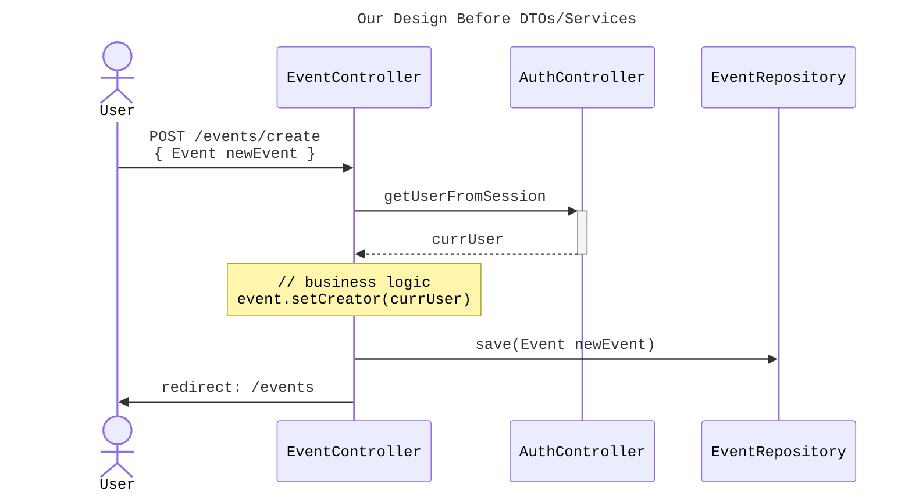
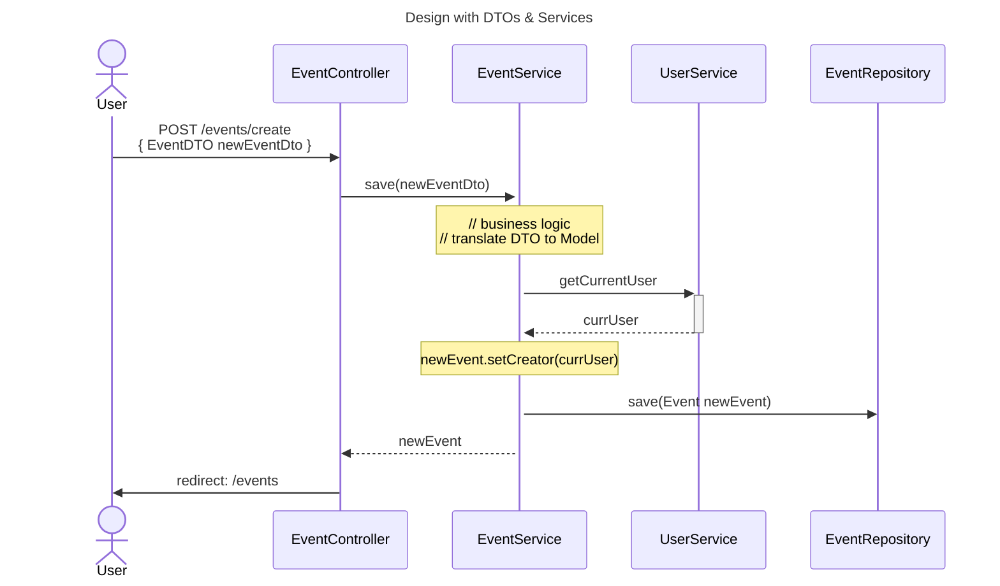

It's time for us to expand on a previous topic used in Chapter 18.
We used **Data Transfer Objects** or DTOs to separate the structure
of our Models from the needs of our client requests or views.

## Separating Business Logic from Controllers

For example, we have a `RegisterFormDTO` containing a necessary `verifyPassword`
field when registering a new account, *but* the `verifyPassword` is not a field
that we need to store in the model. Our DTOs allow us to create data objects
that are specific to the requirements of a form or client request. They
translate the database definition in the Model to the client requirement of
a request.

In order to facilitate the translation of the database Models to a DTO, we will
add another "layer" to our design. The [sequence diagrams](https://en.wikipedia.org/wiki/Sequence_diagram)
below show how we will use modules
called **Services** to manage the interactions between the **Controllers** and the
**Repositories** / **Models**.

{}
Services are a design concept laid out in [Domain Driven Design](https://en.wikipedia.org/wiki/Domain-driven_design).
Any logic that does not fit neatly in to an object, such as the Controller
or Model, can be expressed as a service.
{}



In our current design without **Services**, our "business logic" --- the logic
that validates and configures our data before saving to the database --- is
handled in the **Controllers**. Our `Event` model also contains fields that are
not used in the `Create Event` form that users complete, such as `user_id`.

We can create a DTO that directly maps to the `Create Event` form,
which gives us flexibility to create customized forms with fields unrelated to
the database models. Again, consider the `RegisterFormDTO` which contained the
`verifyPassword` field, a necessary field for the form that does not end up in
the `User` Model.

With DTOs, our "business logic" will now include the translation of DTO fields to
Model fields. Rather than having this logic clutter our Controllers, we can
move it to the Service layer. Take a look at the diagram below and notice how
our `EventController` passes the `EventDTO` to the `EventService`, where the
"business logic" now resides.



## Adding DTOs & Services to CodingEvents - Video

**TODO**

## Adding DTOs & Services to CodingEvents - Text

### Adding `EventDTO` & `EventCategoryDTO`
We'll start by adding the `EventDTO`. This will be a POJO class that contains
every field from our `Create Event` form. Notice the flattening of the
`EventDetails`, meaning that the DTO has the fields from `EventDetails`
instead of a separate class/object for them.

Create a new package inside `codingevents` named `dto`, and move your
`RegisterFormDTO` and `LoginFormDTO` into the package.

Next, let's create the `EventDTO` class in the same package.

```java
public class EventDTO {
    @NotBlank(message = "Name is required")
    @Size(min = 3, max = 50, message = "Name must be between 3 and 50 characters")
    private String name;

    @Size(max = 500, message = "Description too long!")
    private String description;

    @NotBlank(message = "Email is required")
    @Email(message = "Invalid email. Try again.")
    private String contactEmail;

    private int categoryId;

    private int[] tagIds;

    public EventDTO() {}

    // Add setters & getters...
}
```

Add the getters and setters for the fields. Let's also add the DTO for
`EventCategory`. Create `EventCategoryDTO` in the `dto` package as well.

```java
public class EventCategoryDTO {
    @Size(min=3, message="Name must be at least 3 characters long")
    private String name;

    public EventCategoryDTO() {}

    // Add getters & setters...
}
```

### Prepping `User` model for `UserService`

We have a few updates we need to make to the `User` model to prep it for use
with the `UserService`. Namely, we need to move the `PasswordEncoder` class to
its own managed config. Our password encoder is currently a static instance
in the `User` model, but we will need access to our encoder within the
`UserService` so that we can validate a login password against the user's
encrypted password.

#### Creating `PasswordEncoder` bean

This password encoder object will be a managed Java bean, similar to a
controller, that can be referenced using an `@Autowired` field.

First, create a new package `config` within your `codingevents` package. Then,
create a new class `EncoderConfig` in the package.

```java
@Configuration
public class EncoderConfig {
    @Bean
    public PasswordEncoder passwordEncoder() {
        return new BCryptPasswordEncoder();
    }
}
```

The `@Configuration` annotation tells Spring that this class will contain
`@Bean` definitions for Spring managed objects. Inside the class, we
define a `@Bean` that will return an instance of the `BCryptPasswordEncoder`
that we were using the `User` class.

#### Refactoring `User` model

Next, we need to modify our `User` model for use of the `PasswordEncoder`.
We are going to rework our constructor so that a new `User` instance gets
the encoded password passed in, and the `User` object will not be responsible
for doing any encoding.

Remove the field containing the `static final BCryptPasswordEncoder`.

Modify the `User` constructor so that it takes in `String pwHash` as an argument
and uses it to set the field directly, removing the call to `encode`.

Lastly, remove the `isMatchingPassword` method and replace it with a getter for
the `pwHash` field.

Our `User` class is now refactored. Instead of having the `User` class be
responsible for encoding passwords, we will do password encryption in the
`UserService` and pass encrypted passwords to new `User` instances.

### Adding `UserService`

The reponsibilities of the service layer are to translate DTOs to Models
and handle interactions between the Controller and the Repository. To follow
this design, let's add a service to handle interactions between
`AuthenticationController` and `UserRepository`, and translating
`RegisterFormDTO` to `User` models.

{}
Services are built in to the [Spring Framework](https://docs.spring.io/spring-framework/docs/current/javadoc-api/org/springframework/stereotype/Service.html).
A class annotated with `@Service` will become a managed component
in the Spring application context, similar to `@Controller`, meaning that the
instance will be created by the Spring context. We can get a reference to a
service object in a different class using the `@Autowired` annotation.
{}

Let's first add a package `services` inside the `codingevents` package. Create
the `UserService` class inside this package.

```java
@Service
public class UserService {

    @Autowired
    private UserRepository userRepository;

    @Autowired
    private PasswordEncoder passwordEncoder;

}
```

Our `UserService` is going to expose a few methods:

* `User findByUsername(String username)`: retrieves `User` from
`UserRepository` by the `username`
* `Optional<User> findById(Integer id)`: expose `UserRepository`
functionality for possible use
* `List<User> findAll()`: expose `UserRepository` functionality
for possible use
* `User deleteUser(Integer id)`: expose `UserRepository` functionality
for possible use
* `User save(RegisterFormDTO registration)`: validates data in
`RegisterFormDTO` and creates a new `User` in `UserRepository`
* `boolean validateUser(User user, String password)`: validate a password
by encoding it and comparing to the encoded `User` password.
* `User getCurrentUser()`: retrieves currently logged in `User` from
the `user` attribute in `HttpSession` which is loaded from the
current request context

#### Add methods to expose `UserRepository` functionality

Our `UserService` needs to expose some of the basic functionalities of the
`UserRepository` to the controllers. Add the following methods to your
`UserRepository` class. Don't worry about the `userNotFoundException` --- we
will add this definition in the next section.

```java
    public User findByUsername(String username) {
        return userRepository.findByUsername(username);
    }

    public Optional<User> findById(Integer id){
        return userRepository.findById(id);
    }

    public List<User> findAll() {
        return (List<User>) userRepository.findAll();
    }

    public User deleteUser(Integer id) {
        User user = userRepository.findById(id)
                .orElseThrow(userNotFoundException(id));
        userRepository.delete(user);
        return user;
    }
```

#### Add custom error handlers

We have to add proper error handling to
our site. When we throw an error during request handling, we can trigger an
automatic error page template to be shown. The automatic error page
will be covered in the next lesson, but for now, we can add our custom
`Exception` type when a resource is not found.

First we need to add a definition for the `userNotFoundException`in `UserService`.
This is a method that supplies a more generic `ResourceNotFoundException` with a
custom message. Add this method to the end of your `UserService` class.

```java
    private Supplier<ResourceNotFoundException> userNotFoundException(Integer id) {
        return () -> new ResourceNotFoundException("User with id %d could not be found");
    }
```

Next we need to define our custom exceptions that will be used to trigger the
error template. Add a new package called `exceptions` in `org.launchcode.codingevents`.
Then create a new class in that package called `ResourceNotFoundException`. This
will extend `RuntimeException` and give us a new exception type for our needs.

```java
public class ResourceNotFoundException extends RuntimeException {
    public  ResourceNotFoundException() {

    }

    public ResourceNotFoundException(String message) {
        super(message);
    }

    public ResourceNotFoundException(String message, Throwable cause) {
        super(message, cause);
    }

    public ResourceNotFoundException(Throwable cause) {
        super(cause);
    }

    public ResourceNotFoundException(String message, Throwable cause,
                                     boolean enableSuppression,
                                     boolean writeableStackTrace) {
        super(message, cause, enableSuppression, writeableStackTrace);
    }
}
```

#### Add `getCurrentUser()` method

One more piece to add in `UserService`, we have to add a `getCurrentUser()` method.

We will do some fancy Spring Framework logic to retrieve the `HttpSession` from
the current HTTP request context, and then get the `User` object similarly to
how we do it in `AuthenticationController`.

Add this method to your `UserService` below the fields.

```java
    public User getCurrentUser() {
        ServletRequestAttributes attr = (ServletRequestAttributes) RequestContextHolder.currentRequestAttributes();
        HttpSession session = attr.getRequest().getSession(true);

        Integer userId = (Integer) session.getAttribute("user");
        if (userId == null) {
            return null;
        }

        Optional<User> user = findById(userId);

        if (user.isEmpty()) {
            return null;
        }

        return user.get();
    }
```

### Adding `EventService` and `EventCategoryService`

We will add a service "layer" to our design that will be responsible for
translating DTOs to Models and communication between the `EventController` and
`EventRepository`

#### `EventService`

Let's create another class in the `services` package named `EventService`.

```java
@Service
public class EventService {

    @Autowired
    private EventRepository eventRepository;

    @Autowired
    private EventCategoryRepository categoryRepository;

    @Autowired
    private UserService userService;

}
```

Our service will need references to the repositories so that it can access
the database, and a reference to `UserService` so that it can retrieve the
currently logged-in user.

Next let's add some methods that will expose database functionality. Notice
how we use the new `findAllByCreator` and `findByIdAndCreator` repository
methods to filter events by user.

```java
    public List<Event> getAllEvents() {
        return (List<Event>) eventRepository.findAll();
    }

    public List<Event> getAllEventsByCreator(User creator) {
        return eventRepository.findAllByCreator(creator);
    }

    public Event getEventById(int id) {
        return eventRepository.findById(id).orElseThrow(ResourceNotFoundException::new);
    }

    public Event getEventByIdAndCreator(int id, User creator) {
        return eventRepository.findByIdAndCreator(id, creator).orElseThrow(ResourceNotFoundException::new);
    }

    public void removeEventById(int id) {
        eventRepository.deleteById(id);
    }
```

Last, we must add a `save` method, which
takes in an `EventDTO` object and will translate it to our `Event` and
`EventDetails` models before saving to the database.

```java
    public Event save(EventDTO eventDTO) {
        Event event = new Event();
        event.setName(eventDTO.getName());

        EventDetails details = new EventDetails(eventDTO.getDescription(), eventDTO.getContactEmail());
        event.setEventDetails(details);

        event.setEventCategory(categoryRepository.findById(eventDTO.getCategoryId()).get());

        event.setCreator(userService.getCurrentUser());

        eventRepository.save(event);

        return event;
    }
```

#### `EventCategoryService`

Similar to our `EventService`, we must add methods to the `EventCategoryService`
to expose functionality of the `EventCategoryRepository` to the controllers.

```java
@Service
public class EventCategoryService {

    @Autowired
    private EventCategoryRepository categoryRepository;

    @Autowired
    private UserService userService;

    public List<EventCategory> getAllCategories() {
        return (List<EventCategory>) categoryRepository.findAll();
    }

    public List<EventCategory> getAllCategoriesByCreator(User creator) {
        return categoryRepository.findAllByCreator(creator);
    }

    public List<EventCategory> getAllCategoriesByCurrentUser() {
        return categoryRepository.findAllByCreator(userService.getCurrentUser());
    }

    public EventCategory getCategoryById(int id) {
        return categoryRepository.findById(id).orElseThrow(ResourceNotFoundException::new);
    }

    public EventCategory getCategoryByIdAndCreator(int id, User creator) {
        return categoryRepository.findByIdAndCreator(id, creator).orElseThrow(ResourceNotFoundException::new);
    }

    public EventCategory save(EventCategoryDTO categoryDTO) {
        EventCategory category = new EventCategory();
        category.setName(categoryDTO.getName());
        category.setCreator(userService.getCurrentUser());

        categoryRepository.save(category);

        return category;
    }

}
```

Now that our service layer is added, we can refactor our controllers to use them
and our form views to use DTOs.

### Refactoring Controllers & Views

For now, we will continue to use `authController` to retrieve the current user
in the controller. In the next lesson, we will remove all references to
`authController` in `EventController` and `EventCategoryController`, which is
how the sequence diagram above is organized.

#### `EventCategoryController`

Let's start by refactoring our `EventCategoryController` to use the
`EventCategoryService` and `EventCategoryDTO`.

Change the `EventCategoryRepository` field to be `EventCategoryService`, like below:

```java
    @Autowired
    private EventCategoryService eventCategoryService;
```

Now, we can refactor all references to the `eventCategoryRepository` to be
`eventCategoryService` references and we can use `EventCategoryDTO` in the
create form.

```java {hl_lines="5"}
    @GetMapping
    public String displayAllCategories(Model model, HttpSession session) {
        User currUser = authController.getUserFromSession(session);
        model.addAttribute("title", "All Categories");
        model.addAttribute("categories", eventCategoryService.getAllCategoriesByCreator(currUser));
        return "eventCategories/index";
    }
```

```java {hl_lines="3"}
    @GetMapping("create")
    public String renderCreateEventCategoryForm(Model model) {
        model.addAttribute("title", "Create Category");
        model.addAttribute(new EventCategoryDTO());
        return "eventCategories/create";
    }
```

```java {wrap="true" hl_lines="2 10"}
    @PostMapping("create")
    public String processCreateEventCategoryForm(@Valid @ModelAttribute EventCategoryDTO eventCategoryDto,
                                                 Errors errors, Model model, HttpSession session) {

        if (errors.hasErrors()) {
            model.addAttribute("title", "Create Category");
            return "eventCategories/create";
        }

        eventCategoryService.save(eventCategoryDto);
        return "redirect:/eventCategories";
    }
```

#### `EventController`

Similar to above, let's start by changing the repository fields to service fields, like below:

```java
    @Autowired
    private EventService eventService;

    @Autowired
    private EventCategoryService eventCategoryService;
```

Now to update the request handlers to use `eventService` and `eventCategoryService`.
For now we will add a `try/catch` block to catch `ResourceNotFoundException` if the
category ID is invalid.

```java {hl_lines="7 9-16"}
    @GetMapping
    public String displayEvents(@RequestParam(required = false) Integer categoryId, Model model, HttpSession session) {
        User currUser = authController.getUserFromSession(session);

        if (categoryId == null) {
            model.addAttribute("title", "All Events");
            model.addAttribute("events", eventService.getAllEventsByCreator(currUser));
        } else {
            try {
                EventCategory category = eventCategoryService.getCategoryByIdAndCreator(categoryId, currUser);

                model.addAttribute("title", "Events in category: " + category.getName());
                model.addAttribute("events", category.getEvents());
            } catch(ResourceNotFoundException ex) {
                model.addAttribute("title", "Invalid Category ID: " + categoryId);
            }
        }

        return "events/index";
    }
```

```java {hl_lines="5-6"}
    @GetMapping("create")
    public String displayCreateEventForm(Model model, HttpSession session) {
        User currUser = authController.getUserFromSession(session);
        model.addAttribute("title", "Create Event");
        model.addAttribute(new EventDTO());
        model.addAttribute("categories", eventCategoryService.getAllCategoriesByCreator(currUser));
        return "events/create";
    }
```

```java {hl_lines="2 7 11"}
    @PostMapping("create")
    public String processCreateEventForm(@ModelAttribute @Valid EventDTO newEventDto,
                                         Errors errors, Model model, HttpSession session) {
        User currUser = authController.getUserFromSession(session);
        if(errors.hasErrors()) {
            model.addAttribute("title", "Create Event");
            model.addAttribute("categories", eventCategoryService.getAllCategoriesByCreator(currUser));
            return "events/create";
        }

        eventService.save(newEventDto);
        return "redirect:/events";
    }
```

```java {hl_lines="5 14"}
    @GetMapping("delete")
    public String displayDeleteEventForm(Model model, HttpSession session) {
        User currUser = authController.getUserFromSession(session);
        model.addAttribute("title", "Delete Events");
        model.addAttribute("events", eventService.getAllEventsByCreator(currUser));
        return "events/delete";
    }

    @PostMapping("delete")
    public String processDeleteEventsForm(@RequestParam(required = false) int[] eventIds) {

        if (eventIds != null) {
            for (int id : eventIds) {
                eventService.removeEventById(id);
            }
        }

        return "redirect:/events";
    }
```

```java {hl_lines="5-12"}
    @GetMapping("detail")
    public String displayEventDetails(@RequestParam Integer eventId, Model model, HttpSession session) {
        User currUser = authController.getUserFromSession(session);

        try {
            Event event = eventService.getEventByIdAndCreator(eventId, currUser);

            model.addAttribute("title", event.getName() + " Details");
            model.addAttribute("event", event);
        } catch (ResourceNotFoundException ex) {
            model.addAttribute("title", "Invalid Event ID: " + eventId);
        }

        return "events/detail";
    }
```

#### Updating Views to use DTOs

Now that we have our controllers updated to use services, we have to update
our views to make use of DTOs for the `create` forms.

First we will update `events/create.html`. We will use the `eventDTO`
attribute that we passed in to the template for model binding.

```html {hl_lines="4 6 10 12 16 18 22 28" title="events/create.html"}
<form method="post">
    <div class="form-group">
        <label>Name
            <input th:field="${eventDTO.name}" class="form-control">
        </label>
        <p class="error" th:errors="${eventDTO.name}"></p>
    </div>
    <div class="form-group">
        <label>Description
            <input th:field="${eventDTO.description}" class="form-control">
        </label>
        <p class="error" th:errors="${eventDTO.description}"></p>
    </div>
    <div class="form-group">
        <label>Contact Email
            <input th:field="${eventDTO.contactEmail}" class="form-control">
        </label>
        <p class="error" th:errors="${eventDTO.contactEmail}"></p>
    </div>
    <div class="form-group">
        <label>Category
            <select th:field="${eventDTO.categoryId}">
                <option th:each="eventCategory : ${categories}"
                        th:value="${eventCategory.id}"
                        th:text="${eventCategory.name}"
                ></option>
            </select>
            <p class="error" th:errors="${eventDTO.categoryId}"></p>
        </label>
    </div>
    <div class="form-group">
        <input type="submit" value="Create" class="btn btn-success">
    </div>
</form>
```

Lastly, we will update `eventCategories/create.html` and use the
`eventCategoryDTO` that we passed in for model binding.

```html {hl_lines="4 6"}
<form method="post">
  <div class="form-group">
    <label>Name
      <input th:field="${eventCategoryDTO.name}" class="form-control">
    </label>
    <span th:errors="${eventCategoryDTO.name}" class="error"></span>
  </div>
  <input type="submit" value="Create" class="btn btn-primary">
</form>
```

Our updates should be complete. There should be no change in functionality
for Coding Events. Be sure to test the create, read, and delete functions.

The next section will begin a process to add user roles and privileges
to Coding Events. First, we will introduce `Role` and `Privilege` models
that can be associated with `User` models.
