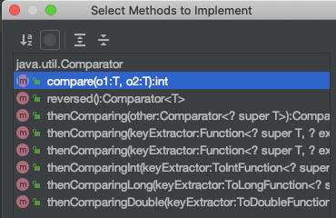
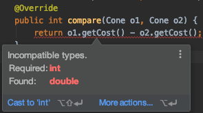

# Exercises: Interfaces and Polymorphism {#interfaces-and-polymorphism-exercises}

As a new Java coder, it might take you some time to recognize the
usefulness of interfaces. At first glance, these tools do not seem to
provide much benefit over extending a base class, adding instance
methods to a class, or overriding a method like `toString`.

To help overcome this, let\'s consider a common occurrence\-\--sorting
an `ArrayList` of objects.

1.  If the list contains `String` or numerical entries, then sorting the
    list is `trivial <arraylist-methods>`{.interpreted-text role="ref"}:

    ``` java
    Collections.sort(arrayListName);
    ```

2.  However, if the elements are custom objects (like `Cat`), then
    sorting the list becomes more complicated. This is because the
    objects may contain multiple fields, any of which could be used as a
    sorting option. For `Cat` objects, this could include `name`, `age`,
    or `mass`.

## Getting Started

Work on these exercises in the IntelliJ `java-web-dev-exercises`
project. You will find the starter code in the `lsn7interfaces` package.
Go ahead and open the folder and take a quick look at the class files.

You will practice implementing interfaces by playing around with a small
ice cream store. It consists of a refrigerated display `Case`, which
contains a collection of ice cream `Flavor` objects and a selection of
`Cone` objects.

::: admonition
Tip

Did you notice the abstract `Ingredient` class? This gets extended into
`Flavor` and `Cone` to help streamline the code.
:::

## Sorting Flavors by Name

To display a menu for your customers, you need to sort the ice cream
flavors alphabetically by their `name` field. Fortunately, the
`Comparator` interface helps you solve the sorting-objects-by-field
problem.

### Create a Sorting Class

1.  Create a new class called `FlavorComparator` and have it implement
    the `Comparator` interface:

    ``` java
    public class FlavorComparator implements Comparator<Flavor>
    ```

2.  Notice that IntelliJ flags a couple of errors that you need to fix:

    a.  Import `java.util.Comparator`. This removes the flag on
        `Comparator`.

    b.  Hover over the line again and select *implement methods*. Choose
        the `compare` option.

        

    c.  This adds an `@Override` method that compares two `Flavor`
        objects and *always* returns `0`.

        ``` {.java lineno-start="6"}
        @Override
        public int compare(Flavor o1, Flavor o2) {
           return 0;
        }
        ```

3.  Always returning `0` results in no sorting, so replace line 8 with:

    ``` java
    return o1.getName().compareTo(o2.getName());
    ```

    This returns an integer (negative, positive, or zero) depending on
    whether `Flavor` object `o1` or `o2` comes first, alphabetically.

`Check your solution <interfaces-and-polymorphism-exercise-solutions1>`{.interpreted-text
role="ref"}

### Sorting the `flavors` ArrayList

In `Main`, we declare `menu` that contains everything in the `Case` as
well as specific `flavors` and `cones` collections.

``` {.java lineno-start="6"}
public static void main(String[] args){
   Case menu = new Case();
   ArrayList<Flavor> flavors = menu.getFlavors();
   ArrayList<Cone> cones = menu.getCones();

}
```

1.  To sort the `flavors` list, first create a new `FlavorComparator`
    object.

    ``` {.java lineno-start="6"}
    public static void main(String[] args){
       Case menu = new Case();
       ArrayList<Flavor> flavors = menu.getFlavors();
       ArrayList<Cone> cones = menu.getCones();
       Comparator comparator = new FlavorComparator();
    }
    ```

2.  Next, call the `sort` method on `flavors` and pass the `comparator`
    object as the argument.

    ``` {.java lineno-start="6"}
    public static void main(String[] args){
       Case menu = new Case();
       ArrayList<Flavor> flavors = menu.getFlavors();
       ArrayList<Cone> cones = menu.getCones();
       Comparator comparator = new FlavorComparator();

       flavors.sort(comparator);
    }
    ```

3.  Iterating through the `flavors` list before and after the sort shows
    the results. (The output below displays just the `name` fields).

    ``` bash
    Before:                 After:

    Vanilla                 Chocolate
    Chocolate               Red Velvet
    Red Velvet              Rocky Road
    Rocky Road              Strawberry Sorbet
    Strawberry Sorbet       Vanilla
    ```

Note that `Main` does NOT have to implement the `Comparator` interface.
This only needs to happen in the class that actually uses the `compare`
method.

::: admonition
Tip

Instead of declaring and initializing the `comparator` object, we could
combine steps 1 and 2 by using a single statement:

``` java
flavors.sort(new FlavorComparator());
```
:::

## Sorting Cones by Cost

Now let\'s sort our `cones` list by cost, from least expensive to most
expensive.

1.  Create the new class `ConeComparator`.

2.  Follow the example above to implement the `Comparator` interface and
    evaluate `Cone` objects by cost.

3.  In `Main`, sort the `cones` list, then print the elements to the
    screen to verify the results.

    ``` bash
    Before:           After:

    Waffle: $1.25        Bowl: $0.05
    Sugar: $0.75         Wafer: $0.50
    Wafer: $0.50         Sugar: $0.75
    Bowl: $0.05          Waffle: $1.25
    ```

`Check your solution <interfaces-and-polymorphism-exercise-solutions3>`{.interpreted-text
role="ref"}

### Troubleshooting

Did you get this error?



This happens because according to the interface, `compare` MUST return
an integer value, but the `cost` fields are `double` type.

To fix this, use an `if/else if/else` block to evaluate
`o1.getCost() - o2.getCost()`. Return a positive integer, negative
integer, or 0 depending on the result.

## Bonus Exercises

1.  Modify `FlavorComparator` to sort `Flavor` objects by the number of
    allergens, from highest to lowest.
2.  Create a `Topping` class that extends `Ingredient`. Add toppings to
    the `Case` constructor, then choose how to sort a `toppings` array
    in `Main`.

## Next Steps

In these exercises, you practiced implementing existing interfaces. In
the studio activity, you will design and implement your own.
