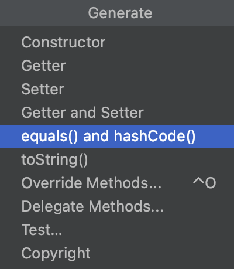
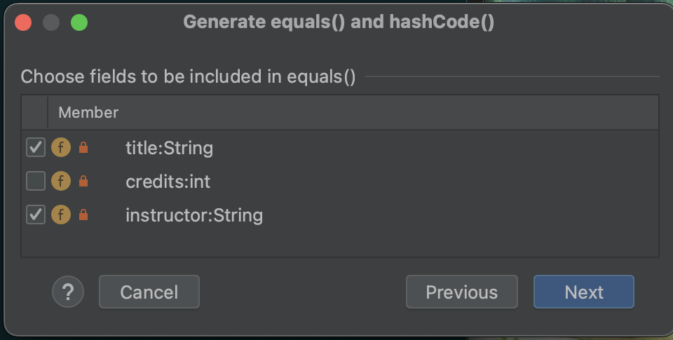

Instead of cutting, pasting, and refactoring old code to ensure that you create a well-structured `hashCode()` method whenever you define your own `equals()` method, you can use IntelliJ’s code generation tool! Just right-click within your class file and select _Generate > equals and hashCode_ and follow the prompts.

Let’s use a Course class to demonstrate:

```java{linenos=table,hl_lines=[],linenostart=1}
public class Course {

   private String title;
   private int credits;
   private String instructor;

   public Course (String title, int credits, String instructor) {
      this.title = title;
      this.credits = credits;
      this.instructor = instructor;
   }
}
```

1. In the IntelliJ editor, right-click in the editor (or on the `Course` class name to be really deliberate), then select _Generate_ from the menu.

1. Select _equals() and hashCode()_.  You will be asked which template to use.  Select _java.util.Objects.equals() and hashCode() (java 7+)_.  This is all we will select for now.


   


1. When you are asked to _Choose fields to be included in equals()_  choose the fields you want equals to consider. Let’s assume that two `Course` objects will be equal if they have the same `title` and `instructor` values.  Select _Next_.


   


1. The next menu will ask you to _Choose the fields you want included in hashCode()_.  This should match the fields you selected when you were setting up the `equals()` method.  Select _Create_.

You should now see two new methods in the `Course` class.

```java{linenos=table,hl_lines=[],linenostart=1}
public class Course {
    private String title;
    private int credits;
    private String instructor;

    public Course (String title, int credits, String instructor) {
        this.title = title;
        this.credits = credits;
        this.instructor = instructor;
    }


    @Override
    public boolean equals(Object o) {
        if (this == o) return true;
        if (o == null || getClass() != o.getClass()) return false;
        Course course = (Course) o;
        return Objects.equals(title, course.title) && Objects.equals(instructor, course.instructor);
    }

    @Override
    public int hashCode() {
        return Objects.hash(title, instructor);
    }
}
```

Looking at the new `equals` method shows that it includes all of the best-practice components:

   1. Line 19 performs the reference check on the object `o`.
   1. Line 20 performs the `null` check and class check on `o`.
   1. Line 21 casts `o` as a `Course` object.
   1. Line 22 compares the `title` and `instructor` fields of the two objects.

## Try it! 

You can use the _Generate_ option to add getters, setters, and `toSting` methods to the `Course` class.