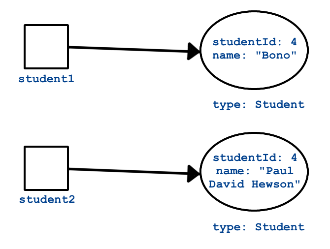

Every class has a few special methods that belong to it, regardless of whether or not we define them. Exactly _how_ every class obtains these methods will be explored in a future lesson. For now, let’s look at two important examples of these methods.

## `toString`

The `toString` method returns a string representation of a class. Calling `toString` on a class that you’ve written will result in something like this:

{} 
```java{linenos=table,hl_lines=[],linenostart=1}
Student person = new Student("Violet");
System.out.println(person.toString());
```
**Console Output:**
```bash
org.launchcode.java.demos.classes2.Student@61bbe9ba
```
{}

Here, we called `toString` on a `Student` object. The default `toString` implementation is generally not very useful. Most of the time, you’ll want to write your own `toString` method to override the default and provide better results.

Here’s how we might do it for `Student` to produce a much more friendly message:

{} 
```java{linenos=table,hl_lines=[],linenostart=1}
public String toString() {
   return name + " (Credits: " + numberOfCredits + ", GPA: " + gpa + ")";
}

Student person = new Student("Violet");
System.out.println(person.toString());
```
**Console Output:**
```bash
Violet (Credits: 0, GPA: 0.0)
```
{}

In the example, we define the `toString` method to return a string that reports the class fields `name`, `numberOfCredits`, and `gpa` in a clear manner.

Note that `toString` is often implicitly called for you. For example, the output above could have been generated by the following code, which calls `toString` on `person` within `System.out.println`.

```java{linenos=table,hl_lines=[],linenostart=1}
Student person = new Student("Violet");
System.out.println(person);
```

## `equals`

Suppose we have two objects of type `Student`, say `student1` and `student2`, and we want to determine if they are equal. If we try to compare them using `==`, we will likely get a result we did not expect. This is because `student1` and `student2` are [reference variables](), which means they hold a reference to, or the address of, the actual `Student` objects. `student1` and `student2` evaluate as equal only when they have the same memory address.

To state that again: `student1` and `student2` will be equal (`==`) only when they refer to, or point at, the exact same object. Consider the example below, which creates two `Student` objects:

{} 
 ```java{linenos=table,hl_lines=[],linenostart=1}
Student student1 = new Student("Maria", 1234);
Student student2 = new Student("Maria", 1234);

System.out.println(student1.name + ", " + student1.id + ": " + student1);
System.out.println(student2.name + ", " + student2.id + ": " + student2);
System.out.println(student1 == student2);
```
**Console Output**
```bash
Maria, 1234: org.launchcode.java.demos.classes2.Student@3e3abc88
Maria, 1234: org.launchcode.java.demos.classes2.Student@6ce253f1
false
```
{}

Even though the objects have the exact same keys and values, `student1` and `student2` point to different memory locations. Therefore, the `==` check returns false.

This is not usually how we want to compare objects. For example, we might want to consider two `Student` objects equal if they have the same name, email, or student ID.

The `equals()` method determines if one object is equal to another in this sense. We introduced the method when discussing strings, but it also applies to all other classes.

The code below shows how to use `equals()` to compare two students. Note that they have different names but the same student ID, indicating they are actually the same person.

```java{linenos=table,hl_lines=[],linenostart=1}
Student bono1 = new Student("Paul David Hewson", 4);
Student bono2 = new Student("Bono", 4);

if (bono1.equals(bono2)) {
   System.out.println(bono1.getName() +
      " is the same as " + bono2.getName());
}
```

If we don’t provide our own `equals()` method, the default option only considers two objects equal if they are the _exact same object_, which means they point to the same memory address. This is identical to the behavior we see when using the `==` operator: `bono1 == bono2`.

In the example above we created two different `Student` objects, so the expression `bono1.equals(bono2)` evaluates to `false`. In order to compare two objects based on their _properties_, rather than their memory references, we need to define our own `equals()` method.

The difference between the comparison carried out by the default `equals()` method (and by the `==` operator), and how we would like to compare our classes, is the difference between _identity_ and _equality_.

   1. Two objects are _identical_ if they both point to the same memory address. In essence, they are the same object. If `object1` and `object2` are identical, then changing one property value in `object1` also changes that value for `object2`.
   1. Two objects are equal if the values they store are the same at the time of comparison. `student1` and `student2` point to different memory addresses, but their values are all the same. Thus, we can consider them equal, even though they are not identical.

The default `equals()` method and the `==` operator test for _identity_, whereas we want to test for equality instead. We can do so by overriding the `equals()` method. We will discuss **overriding** in more detail later, but for now just recognize that it involves defining different behavior for an existing method.

Two things can be considered equal even if they do NOT have all the same values. In the case of the `Student` class, we might specify that two `Student` objects are equal if they have the same ID numbers. We would then write a new method definition for `equals()` as follows:

```java{linenos=table,hl_lines=[],linenostart=1}
public boolean equals(Object toBeCompared) {
   Student theStudent = (Student) toBeCompared;
   return theStudent.getStudentId() == getStudentId();
}
```

Now if we evaluate `bono1.equals(bono2)` we will get a result of true, since the student IDs match.

One catch of working with `equals()` is that its input parameter must be of type `Object`, even if we’re working in a class like `Student`. The reason why will become more clear in the next lesson, when we introduce the `Object` class. For now, the practical implication is that we must convert, or **cast**, the input `toBeCompared` to be of type `Student` with the syntax `(Student) toBeCompared`. Then we compare the converted student’s ID `(bono2.id)` to that of the current student `(bono1.id)`.

Here’s a visualization of the concepts of equality and identity:

### Equality

   



When you test for equality, you look at two different objects and compare some aspect of them to each other.

###  Identity

   


When you test for identity, you look at two variables to see if they reference the exact same object.

### Coding a new `equals` Method

You’ll often want to implement `equals()` yourself. When you do, be sure you understand the best practices around how the method should behave. These are a little more involved compared to coding a new `toString` method.

In fact, the `equals()` method we defined above isn’t very good by most Java programmers’ standards. Let’s improve it.

#### Problem #1

The method argument cannot be converted to a `Student` instance.

When we attempt to cast the argument `toBeCompared` to type `Student`, we’ll get an exception if `toBeCompared` can’t be properly converted. This happens if something other than a `Student` object gets passed into `equals()`. To prevent this from happening, we’ll return `false` if `toBeCompared` was not created from the `Student` class. To check this, we use the `getClass` method, which is available to every object (similarly to `toString`).

```java{linenos=table,hl_lines=[],linenostart=1}
public boolean equals(Object toBeCompared) {

   if (toBeCompared.getClass() != getClass()) {
      return false;
   }

   Student theStudent = (Student) toBeCompared;
   return theStudent.getStudentId() == getStudentId();
}
```

Lines 3 - 5 ensure that the two objects that we want to compare were created from the same class.


#### Problem #2

`toBeCompared` might be `null`.

If `toBeCompared` is `null` then `toBeCompared.getClass()` throws an exception. This is an easy issue to fix—just compare the object to `null`. If the comparison evaluates to true, then we know the object is `null` and `equals()` should return `false`.

```java{linenos=table,hl_lines=[],linenostart=1}
public boolean equals(Object toBeCompared) {

   if (toBeCompared == null) {
      return false;
   }

   if (toBeCompared.getClass() != getClass()) {
      return false;
   }

   Student theStudent = (Student) toBeCompared;
   return theStudent.getStudentId() == getStudentId();
}
```

Line 3 checks `toBeCompared` for `null`, preventing an error in line 7. Line 7 checks the class of `toBeCompared`, preventing an error in line 11.

#### Problem #3

The two objects to compare are the _same_ object (identical).

This is less of a problem and more of a way to improve our `equals()` method. If `toBeCompared` is the same literal object that we are comparing it to, then we can make a quick determination and save a few checks.


```java{linenos=table,hl_lines=[],linenostart=1}
public boolean equals(Object toBeCompared) {

   if (toBeCompared == this) {
      return true;
   }

   if (toBeCompared == null) {
      return false;
   }

   if (toBeCompared.getClass() != getClass()) {
      return false;
   }

   Student theStudent = (Student) toBeCompared;
   return theStudent.getStudentId() == getStudentId();
}
```

Line 3 checks for identity. If true, then the remaining checks become unnecessary.

### Components of `equals`

Almost every `equals` method you write will look similar to the last example above. It will contain the following segments in this order:

   1. **Reference check:** If the two objects are the same, return `true` right away.
   1. **Null check:** If the argument is `null`, return `false`.
   1. **Class check:** Compare the classes of the two objects to ensure a safe cast. Return false if the classes are different.
   1. **Cast:** Convert the argument to the type of our class, so getters and other methods can be called.
   1. **Custom comparison:** Use custom logic to determine whether or not the two objects should be considered equal. This will usually be a comparison of properties or fields.

### Characteristics of `equals`

Now that we know how to write an `equals()` method, let’s look at some characteristics that every such method should have. Following the general outline above makes it easier to ensure that your `equals()` method has these characteristics.

   1. **Reflexivity**: For any non-null reference value `x`, `x.equals(x)` should return `true`.

   1. **Symmetry**: For any non-null reference values `x` and `y`, `x.equals(y)` should return true if and only if `y.equals(x)` also returns `true`.

   1. **Transitivity**: For any non-null reference values `x`, `y`, and `z`, if `x.equals(y)` returns `true` and `y.equals(z)` returns `true`, then `x.equals(z)` should return `true`.

   1. **Consistency**: As long as `x` and `y` do not change `x.equals(y)` should always return the same result.

   1. **Non-null**: For any non-null reference value `x`, `x.equals(null)` should return `false`.

If you think back to what your math classes had to say about equality, then these concepts make sense.

Using the general approach outlined above to implement `equals()` will make it easier to meet these characteristics. However, always check your method! Missing one or more characteristics can be disastrous for your Java applications.

{} 
 Seasoned Java developers will tell you that every time you implement your own version of `equals()` you should also implement your own version of `hashCode()`. `hashCode()` is another special method that every class has. Understanding `hashCode()` would take us a bit far afield at this point, but we would be remiss to not mention it. If you want to read more, check out [this article](https://www.baeldung.com/java-equals-hashcode-contracts) and this [stack overflow](https://stackoverflow.com/questions/2265503/why-do-i-need-to-override-the-equals-and-hashcode-methods-in-java).
{}

### Take Away

You may not need to write your own `equals()` method for every class you create. However, as a new Java programmer, remember the following:

   > Always use `equals()` to compare objects.

This is especially true when working with objects of types provided by Java, such as `String`. A class that is part of Java or a third-party library will have implemented `equals()` in a way appropriate for the particular class, whereas `==` will only check to see if two variables refer to the same literal object.


## Check Your Understanding

{} 
 Given the code:

 ```java{linenos=table,hl_lines=[],linenostart=1}
 public class Pet {

   private String name;

   Pet(String name) {
      this.name = name;
   }

   public String getName() {
      return name;
   }
}

String firstPet = "Fluffy";
Pet secondPet = new Pet("Fluffy");
Pet thirdPet = new Pet("Fluffy");
```
Which of the following statements evaluates to `true`?

1. `firstPet == secondPet;`
1. `secondPet == thirdPet;`
1. `thirdPet.equals(secondPet);`
1. `thirdPet.getName().equals(firstPet);`
1. `thirdPet.equals(firstPet);`

<!-- ans: 4 -->
{}

{} 
We add the following code inside the `Pet` class:

 ```java{linenos=table,hl_lines=[],linenostart=1}
public boolean equals(Object petToCheck) {

   if (petToCheck == this) {
      return true;
   }

   if (petToCheck == null) {
      return false;
   }

   if (petToCheck.getClass() != getClass()) {
      return false;
   }

   Pet thePet = (Pet) petToCheck;
   return thePet.getName() == getName();
}
```
Which of the following statements evaluated to `false` before, but now evaluates to `true`?

1. `firstPet == secondPet;`
1. `secondPet == thirdPet;`
1. `thirdPet.equals(secondPet);`
1. `thirdPet.getName().equals(firstPet);`
1. `thirdPet.equals(firstPet);`

<!-- ans: 3-->
{}