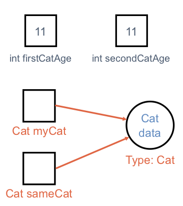

## Arrays

In Java, an array is an ordered, fixed-size collection of elements. To comply with static typing, the items stored in an array must all be the same data type. We can create an array of integers or an array of strings, but we may NOT create an array that holds both integers and strings.

The syntax for creating an array capable of holding 10 integers is:

```java
int[] someInts = new int[10];
```

Note the square brackets next to int. This tells Java that we want someInts to store a collection of integers instead of a single number.

To create an array of a different size, replace the number 10 in the brackets with the desired size. To create an array holding a different type, replace int (on both sides of the assignment) with the desired type, like double or String.

In addition to the example above, we can initialize an array using a literal expression:

```java
int[] someOtherInts = {1, 1, 2, 3, 5, 8};
```

Here, the size of the array is implied by the number of elements in the literal expression `{1, 1, 2, 3, 5, 8}`. Also note the use of curly braces `{ }` instead of square brackets `[ ]`.

To access array elements, we use square brackets and zero-based indexing.

```java
int anInt = someOtherInts[4];
// anInt stores the integer 5.
```

Arrays in Java may NOT change size once created. This is limiting and not very practical. Thankfully, Java provides more flexible ways to store data, which we will explore in a later lesson. These objects will allow us to rearrange, add to, or remove data.

Aside from using arrays to build some simple loop examples, we will only use them in special cases. However, they are a core part of Java, so it’s good to know how they work.

## Java Objects

In Java, **objects** are structures that have a state and a set of _behaviors_. The state of an object includes properties/data that the coder can define and modify. Behaviors are actions that run when requested, and they can be used to evaluate, manipulate, or return data.

An array is one example of an object. It contains _data_, which are the values stored as the individual elements. The _behaviors_ are methods like `sort()` that perform actions related to the elements in the array.

The `String` data type is also an example of an object. For `String language = "Java"`, the data would be the characters. The `String` manipulation section gives several of the behaviors available to the `language` object. For example, `language.length()` returns the value `4`, which tells us how many characters are present in the string.

Every variable in Java refers to either a primitive data type or to an object.

## Class Types

A class is a template for creating objects. In addition to the object types introduced so far, any class in Java also defines a type. We’ll have much more to say about classes and objects, but for now you need to recognize the basic syntax of class types and class creation.

If we have a class Cat, we can declare and create an instance of Cat using the new keyword:

```java
Cat myCat = new Cat();
```
1. `Cat myCat` declares the variable `myCat` and sets it to be of type `Cat`.
1. `= new Cat()` initializes the variable with a new `Cat` object.
1. Any arguments that are required to build the new `Cat` object must be included within the parentheses.

Just like a variable can be declared as a primitive data type like `char` or `double`, it can also be declared as a specific class type. Variables that hold objects—like `String name = "Blake"` or `myCat`—are said to be reference variables. Using this terminology, name is a reference variable of the `String` class, and `myCat` is a reference variable of type `Cat`.

{} 
 Java uses two general data types—primitive and object. A _class type_ is NOT a new data type. Instead, it is just a specific name applied to the more general object data type.

`int` and `char` are both primitive data types, but the values they can store differ. Similarly, `String` and `Cat` are both object types, but they represent different classes.
{}

### Reference Variables
**Reference variables** are different from primitive types in an essential way. A reference variable (such as `myCat` above) does not actually store the object in question. Instead, it stores a reference to the object, which is literally a memory address. We visualize a reference as an arrow pointing to the location of the object in memory.

Consider this code:
```java{linenos=table,hl_lines=[],linenostart=1}
int firstCatAge = 11;
int secondCatAge = firstCatAge;
Cat myCat = new Cat();
Cat sameCat = myCat;
```

Visually, we can represent these four variables as shown below.


   


Since `int` is a primitive type, the variables `firstCatAge` and `secondCatAge` function like separate boxes, each one holding the integer value `11`. On the other hand, `myCat` is a reference variable, since it refers to an object of type `Cat`. The variable actually stores the memory address of the object, which we visualize as an arrow pointing from the variable box to where the data is stored. Instead of holding the actual `Cat` data, `myCat` stores directions for finding the data in memory.

When we assign `myCat` to another variable, as in `Cat sameCat = myCat`, we do NOT create a second copy of the object or its data. Instead, we make a second arrow pointing to the same memory location.

The distinction between object types and primitives is important, if subtle. As you continue learning Java, you will see that object types are handled differently in essential and important ways.

## Static Methods

If you are familiar with another programming language, then you most likely defined and called functions. As a pure object-oriented programming language, Java also uses functions, but it structures them in a very specific way.

In Java, functions may NOT be declared outside of a class. Even a simple function that checks if an integer is even needs to be defined within a class.

Within the context of a class, functions are referred to as **methods**, and we will adopt this terminology from now on.

{} 
 Be prepared to receive a vocabulary lesson from veteran Java coders if you accidentally refer to _methods_ as _functions_.
{}

We’ll dive deeper into classes and objects in Java soon enough. For now, we will explore how to write methods. In particular, we’ll use static methods. A static method is one that can be called without creating an instance of the class to which it belongs.

### Static Method Examples

Let’s examine two classes in Java to explore defining and using methods. The first class is defined in the `HelloMethods.java` file, and it has a `main` method. The second class is defined in a separate `Message.java` file, and it contains a `getMessage` method that we want to call from within `main`.

{} 
 `HelloMethods.java`

 ```java{linenos=table,hl_lines=[],linenostart=1}
   public class HelloMethods {

      public static void main(String[] args) {
         String message = Message.getMessage("fr");
         System.out.println(message);
      }

   }
```

`Message.java`
 ```java{linenos=table,hl_lines=[],linenostart=1}
   public class Message {

      public static String getMessage(String lang) {

         if (lang.equals("sp")) {
            return "¡Hola, Mundo!";
         } else if (lang.equals("fr")) {
            return "Bonjour, le monde!";
         } else {
            return "Hello, World!";
         }
      }
   }
```
{}

We won’t explore every new aspect of this example, but instead focus on the two methods.

1. The `main` method in the `HelloMethods` class has the same structure as that of our [temperature conversion example]({}).

1. Take a look at the `Message` class. Note that it does NOT have a `main` method, so it can’t be run on its own. Code within the `Message` class must be called from elsewhere in order to execute.

1. The `Message` class contains the `getMessage` method. Like `main`, it has the `static` keyword. Unlike `main`, `getMessage` has a return type of `String` instead of `void`.

1. `getMessage` takes a single `String` parameter, `lang`.


Since Java is statically typed, we must declare the data type for each parameter AND the return value.

```java
public static returnedDataType methodName(parameterDataType parameterName) {
   //code
}
```

One consequence of this is that a method in Java may NOT have `return` statements that send back different types of data. Note that lines 6, 8, and 10 in `Message.java` each return a string. If we try to replace line 10 with `return 42;`, we would generate a compiler error.

To call a static method, we follow a specific syntax. Line 4 in the `HelloMethods.java` shows this:

```java
Message.getMessage("fr");
```

To call a static method we must use the format `ClassName.methodName(arguments)`.

Note that `getMessage` is NOT defined within the `HelloMethods` class. We can do this because `getMessage` is declared as `public`. If we wanted to restrict the method from being called by another class, we could instead use the `private` modifier. We will explore access modifiers in more depth in coming lessons.

{} 
 As you have been following along with these examples, you may have noticed that each class file, for example `Message.java` and `HelloMethods.java`, is named exactly the same as the class it holds (`Message` and `HelloMethods`, respectively).

It is a rule in Java that a file containing a class marked `public` MUST be named the same as that class.
{}

### Try It

Open the `HelloMethods` and `Messages` files in the `java-web-dev-projects` project in IntelliJ and experiment with the following:

1. Figure out how to alter the `HelloMethods` code to change the message returned.
1. Add another “Hello, World” language option.
1. Change one `public` keyword to `private` to see what happens. Repeat for each occurrence of `public`.

## References
1. [Arrays (doc.oracle.com)](https://docs.oracle.com/javase/tutorial/java/nutsandbolts/arrays.html)

## Check Your Understanding

{} 
 Which of the following defines a method that takes an integer as a parameter and returns a string value?
   1. `public static void methodName(String parameterName)`
   1. `public static void methodName(int parameterName)`
   1. `public static int methodName(String parameterName)`
   1. `public static String methodName(int parameterName)`

<!-- ans: public static void methodName(int parameterName) -->
{}

{} 
 Assume that we declare the following Java array:

 ```java
 String[] someWords = new String[5];
```
Which of the following shows a correct initialization for the array?

1. `someWords = {'hello', 'world', '123', 'LaunchCode ROCKS!'}`
1. `someWords = {"hello", "world", "123", "LaunchCode ROCKS!", "Java"}`
1. `someWords = {"hello", "world", 'a', "LaunchCode ROCKS!", "Java"}`
1. `someWords = {"hello", "world", "avocado", "LaunchCode ROCKS!"}`

<!-- ans -- 'someWords = {"hello", "world", "123", "LaunchCode ROCKS!", "Java"}' -->
{}

