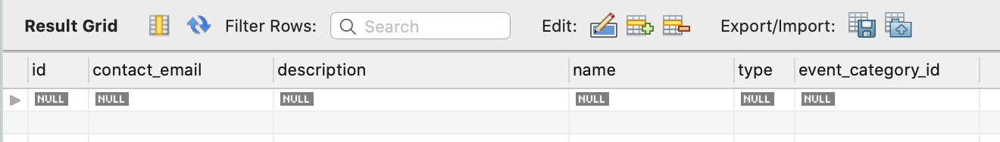

The first relationship we implement will be between the `Event` and `EventCategory` classes. We will allow multiple events to be in the same category, but each event will only have one category. Thus, this will be a many-to-one relationship.

Before diving in, let's reduce repetition in our persistent classes, that is, let's DRY out our code.

## Creating an `AbstractEntity` - Video



{} 

   The starter code for this video is found at the [event-category branch](https://github.com/LaunchCodeEducation/CodingEventsJava/tree/event-category) of the `CodingEventsJava` repo. 
   The final code presented in this video is found on the [abstract-entity branch](https://github.com/LaunchCodeEducation/CodingEventsJava/tree/abstract-entity). As always, code along to the 
   videos on your own `coding-events` project.

{}

## Creating an `AbstractEntity` - Text

<!-- TODO: Add link to Chapter 17 -->

The steps needed to implement `AbstractEntity` are outlined in studio in the previous chapter.

## Setting Up the Relationship - Video

We are now ready to create a relationship between `Event` and `EventCategory`.



{} 

   The starter code for this video is found at the [abstract-entity branch](https://github.com/LaunchCodeEducation/CodingEventsJava/tree/abstract-entity)  of the `CodingEventsJava` repo. 
   The final code presented in this video is found on the [many-to-one branch](https://github.com/LaunchCodeEducation/CodingEventsJava/tree/many-to-one). As always, code along to the 
   videos on your own `codingevents` project.

{}

## Setting Up the Relationship - Text

Our many-to-one relationship is established in the `Event` class; each event will have one category, and there may be many events in a given category. 

Currently, similar functionality is enabled via the `EventType` field of `Event`. However, `EventType` is an enum, which means that new values can not be added without changing the code and re-compiling. Using the persistent `EventCategory` class to organize events will be a much more flexible and user-friendly approach. 

### Replacing `EventType` With `EventCategory`

In the `Event` class, replace the `type` field with a new private field of type `EventCategory`:

```java {linenostart=25}
private EventCategory eventCategory;
```

This will introduce compiler errors wherever `type` is referenced. We will fix these shortly.

First, however, update `Event` so that:

1. Its main constructor (i.e. NOT the no-arg constructor) takes a parameter of type `EventCategory` and uses it to initialize `eventCategory`.
1. It has a getter/setter pair for `eventCategory`.
1. The `eventCategory` field has the `@NotNull` validation annotation, along with an appropriate message.

This establishes a relationship between the two classes, but that relationship is not yet *persistent*. To configure Hibernate to keep track of this relationship in the database, we add the `@ManyToOne` annotation to `eventCategory`. 

```java {linenostart=27}
@ManyToOne
@NotNull(message = "Category is required")
private EventCategory eventCategory;
```

This annotation informs Hibernate that there can be many events for each category, but only one category per event. 

Before we can start up the app and test our changes, we need to remove the code that references the deleted `type` field. A quick way to find these references is to find `EventType` in the *Project* pane of IntelliJ, right-click, and select *Find Usages*. This will open a pane listing each location where `EventType` occurs in our project, whether that is an object of that type or a direct reference to the class itself. 


The first occurrence is in `EventController.displayCreateEventForm`:

```java {linenostart=35}
model.addAttribute("types", EventType.values());
```

This line passes a collection of all of the values of `EventType` into the view, to be rendered in the form used to create new events.

Since we are now using `EventCategory` to group events, our code should instead be passing in all of the category objects in our app. To fetch category objects, we need an instance of `EventCategoryRepository` in our controller. Add an `@Autowired` instance to the top of the controller:

```java {linenostart=24}
@Autowired
private EventCategoryRepository eventCategoryRepository;
```

Now, use the repository to fetch all saved categories:

```java
model.addAttribute("categories", eventCategoryRepository.findAll());
```

This line replaces the line references `EventType.values()`. Notice that we have relabeled this attribute `"categories"` 
to be more consistent. This also requires updating the `events/create.html` template:

```html {linenos=true linenostart = 27}
<div class="form-group">
   <label>Category
   <select th:field="${event.eventCategory}">
      <option th:each="eventCategory : ${categories}"
               th:value="${eventCategory.id}"
               th:text="${eventCategory.name}"
      ></option>
   </select>
   <p class="error" th:errors="${event.eventCategory}"></p>
   </label>
</div>
```

This new template code includes several changes:

1. The `select` is now bound to the field `eventCategory`.
1. The loop references `categories` and has an updated iterator variable name, `eventCategory`.
1. The value of the `select` is now `eventCategory.id`. This allows model binding to occur upon form submission. Spring Boot will determine the category object to assign to the new event object by referencing the `id`.
1. The text for each `option` is now `eventCategory.name`.
1. The error message display now references the new field, `event.eventCategory`.

The remaining usages of `EventType` refer to:

1. An `Event` constructor parameter.
1. The getter/setter pair for `type` in `Event`.
1. An import statement in `EventController`.
1. The `EventType` class itself.

Removing this unneeded code resolves all remaining compiler errors. 

The `events/index.html` template needs to be updated as well, since it still contains a reference to the `type` field of `Event`:

```html
<td th:text="${event.type}"></td>
```

This usage wasn't found by IntelliJ because templates do not receive compile-time type checking like classes do. The updated version looks like this:

```html
<td th:text="${event.eventCategory.name}"></td>
```

### Testing and Database Updates

Before starting up the application, let's look at our `event` table:


Notice that the `type` column remains, even though we have deleted the `type` field from the `Event` class. The next time we start up the application, Hibernate will attempt to update the schema to match the structure of our updated model class. 

{}

   Notice that existing events will not have a category, which violates our new `@NotNull` validation rule. The easiest way to handle this is to delete all rows in `event`.
   
   To delete all events, truncate the `event` table in MySQL Workbench. (To **truncate** a SQL table is simply to delete all its rows.) To do this, select the table in the *Schemas* pane, right-click, and select *Truncate Table...*

{}

Start up the application and refresh the view in MySQL Workbench. 



Notice that there is a new column, `event_category_id`. This new column has type `int` and is a foreign key column to the `event_category` table. References to objects in Java are translated into foreign-key references by Hibernate. 

{}

   You may find it odd that the `type` column is *still* present, even after restarting. Hibernate will not drop columns from a table even if that field is removed from the corresponding class. 

   Hibernate will generally avoid deleting your data, since you may want to keep it around (even if just in the form of a backup). You can simply drop this column yourself.

{}

{}

   If your table was not updating upon restarting, make sure you have `spring.jpa.hibernate.ddl-auto` set to `update` in `application.properties`.

{}

If we create some new events, we can see precisely how `event` rows are related to `event_category` rows.


Notice that our events have `event_category_id` values of `12` and `13` (these values may differ slightly in your application). These are foreign keys into the `event_category` table. For example, in the tables above, the `event` row with `id` equal to `14` is related to the `event_category` row with `id` equal to `12`. This database relationship corresponds to the relationship between objects that was created by Spring Boot when we submitted the form.

With this many-to-one relationship in place, we next look at how to establish a persistent one-to-many relationship.

## Check Your Understanding

{}

   What is the annotation that allows `@AbstractEntity` to handle logic related to IDs/primary keys of subclasses, 
   yet not be mapped to a database table.

{}

<!-- short answer, @MappedSuperclass -->

{}

   You are working on a Spring application tracking elected officials. Your model class, `Senator` has a many-to-one relationship 
   with another model class, `State`. To properly configure this relationship in the Hibernate context, what must be present?

   1. In `Senator`, a `state` field, annotated with `@OneToMany`
   1. In `Senator`, a `state` field, annotated with `@ManyToOne`
   1. In `State`, a `senator` field, annotated with `@OneToMany`
   1. In `State`, a `senator` field, annotated with `@ManyToOne`

{}

<!-- In ``Senator``, a ``state`` field, annotated with ``@ManyToOne`` -->